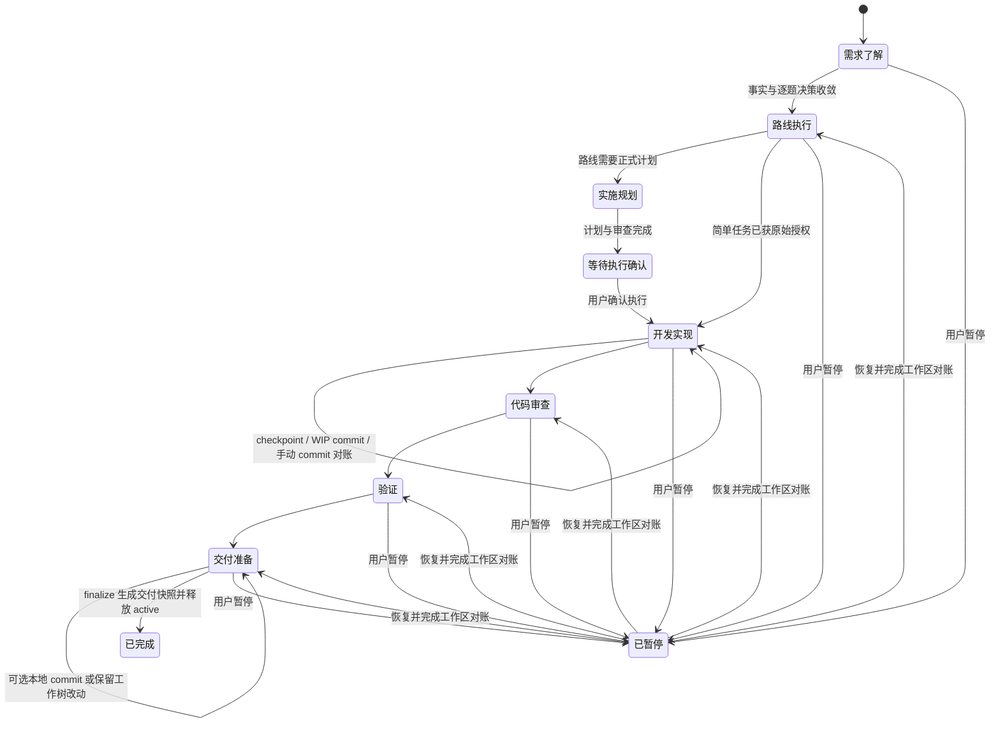

# Dev Flow 4.0 实施计划

> 状态：待实施
> 日期：2026-08-05
> 目标版本：Dev Flow 4.0
> 状态 schema：v3（硬切换，不提供 v2 运行时兼容层）
> 问题来源：`/Users/weixiaoyu/Desktop/practice/AI-aggregation/docs/dev-flow/dev-flow-issues-and-suggestions.md`
> 适用仓库：`/Users/weixiaoyu/Desktop/practice/dev-flow`
> 用途：交给其他模型按里程碑实施；全部完成后再交由 Codex 独立验收

## 0. 执行说明

这不是行为合同，而是实现 Dev Flow 4.0 的施工规格。实施模型必须先阅读本计划、仓库根 `AGENTS.md`、`docs/architecture.md`、`docs/routes.md`、`docs/publishing.md` 和涉及模块的现有测试，再开始修改。

本计划的第一原则是：**凡是属于用户的决策，必须由用户决定；凡是可以由系统查明或安全自动完成的技术动作，不得反复打断用户。** Dev Flow 的目标是智能自动化和可恢复治理，不是用内部状态、ID、token 或相互矛盾的门禁制造摩擦。

### 0.1 完成定义

只有同时满足以下条件，才可声明本计划完成：

1. 本文所有标记为“必须实施”的行为均已有源码、聚焦测试和跨模块验收覆盖。
2. 用户决策、状态推导、审查判定、Git 归属和恢复动作均只有一个 Core 真相源。
3. 正常用户输出使用简明中文；阶段代码、内部 ID、hash、revision、token 和错误签名不进入默认用户文案。
4. 任一失败路径都能收敛为自动恢复、单一用户决策或明确的安全退出，不存在只能手改 `.dev-flow` 才能继续的路径。
5. 中途 commit、手动 commit、脏树启动、暂停恢复、证据失效、风险接受和 finalize 形成完整闭环。
6. Claude 与 Codex 两个受支持宿主的协议测试通过。
7. 目标测试、`npm run typecheck`、`npm run test:unit`、`npm run test:routes`、`npm run test:interop`、`npm run test:e2e`、最终 `npm test` 全部通过。
8. `plugins/dev-flow/dist/` 只在最后发布里程碑通过构建脚本统一更新，且 `npm run build:check` 通过。

### 0.2 不可违反的红线

1. 智能体不得执行 `git commit`、`git push`、创建 PR 或发布；本仓库所有提交由用户审核后手动完成。
2. 不得手工编辑 `.dev-flow` 控制文件、内容寻址 snapshot、projection 或 active pointer。
3. 不得用后台改标记、清 blocker、伪造 resolution、伪造验证或伪造用户批准来“打通”流程。
4. 不得为兼容 v2 保留第二套运行时分支；v3 是硬切换。
5. 不得把宿主、模型名或具体供应商写进 Core 判定；多代理只能提升可审计保证，不能成为必需运行条件。
6. 不得在正式实施批准前修改受保护业务文件；批准前只允许读取、分析、伪代码、接口草图和隔离临时实验。
7. 不得把一次提问变成三四个问题的清单；任何用户决策都必须逐题呈现、逐题回答。
8. 不得在中间阶段运行 `npm run build`；只有任务明确进入最终 bundle 收尾时才运行。
9. 不得覆盖工作区中与本计划无关的用户改动。

## 1. 已确认的产品决策

以下决策是本计划的输入，不允许实施模型自行改写。若实现中发现技术上无法同时满足，必须停止并用中文说明冲突、影响和推荐方案，等待用户裁决。

| 编号 | 已确认决策 |
| --- | --- |
| D01 | 全量覆盖使用记录中的 P1–P11 及 O0、O1、O2、O3、O6；逐项标为修复、加固、文档化、已满足或明确不实施。 |
| D02 | 正式支持 feature 执行期间产生本地 commit，包括用户要求模型提交和用户手动提交。 |
| D03 | feature 达到交付条件后进入 delivery-ready；允许 commit 或明确保留未提交改动，随后再 finalize。 |
| D04 | implementation 获得授权后允许 WIP commit；commit 只保存进度，不代表实现、审查、验证或 finalize 已完成。 |
| D05 | 允许脏工作树启动，但预存改动必须有显式归属；系统不得猜测所有权。 |
| D06 | 历史 review blocker 必须在 successor 中显式处置，禁止“新批次零发现即后台清空”。 |
| D07 | 正常用户交互一律使用简明中文自然语言；`DF-*` token、interaction ID、approval ID、event ID、hash 和内部 status 默认隐藏。 |
| D08 | 技术详情默认隐藏，仅在用户主动排障或提交 bug 时展示。 |
| D09 | 用户决策默认逐题进行；取消批量问题清单、批量解析和“合并剩余”自动选项。 |
| D10 | `dev_flow_status` 改为精简日常状态；详细事实通过按主题 inspect 获取；不保留旧完整公开响应。 |
| D11 | 同一 active feature 最多一个待决问题；所有回答统一走 `dev_flow_answer`。 |
| D12 | 从需求工件移除 `grill_status`、`grill_question_id`、`grill_response_hint`；grill 完成态由 Core 决策账本推导。 |
| D13 | 计划变更后仍需所有必需 review role 完成，但审查包以差异为中心并可引用未变化证据。 |
| D14 | 多代理是可审计增强，不是 Core 硬门禁；额度不足可透明降级，保证等级不得夸大。 |
| D15 | 正式实施计划前必须取得用户批准；简单低风险 XS/S 可把用户原始“请实现/修复”视作授权，诊断/审查请求不能推断写权限。 |
| D16 | 同因连续两次无进展，或累计五次仍不推进，即停止自动修复并给用户一个中文恢复动作。 |
| D17 | 路线显示保留代码并附中文：如 `standard-l：大型变更（标准治理）`；阶段名称只显示中文。 |
| D18 | 模型提交前只允许 feature-owned 文件；用户手动 commit 视为用户已授权，系统审计、纳入并告知，不自动改写历史。 |
| D19 | 手动改动导致审查/验证证据确定性过期时允许自动标记 stale，但绝不自动补审、补验证或改用户决策。 |
| D20 | 系统完整性问题不能伪装成功；流程质量问题可在中文风险说明后由用户明确接受，并留下可审计例外。 |
| D21 | 新增显式 pause/resume；暂停不要求 commit、验证或 finalize，恢复时自动审计期间变化。 |
| D22 | 开始新任务遇到旧 active feature 时不得后台 finalize、abandon 或 switch；只向用户提出一个中文选择。 |
| D23 | schema v3 硬切换；插件发布新的主版本，不实现旧 active/paused feature 的运行时迁移。 |

## 2. 问题处置矩阵

### 2.1 使用记录 P1–P11

| 问题 | 当前事实 | 4.0 处置 | 类型 |
| --- | --- | --- | --- |
| P1 `grill_status` 枚举猜错 | 模板输出状态值但不解释枚举，Core 校验四个值 | 删除 Markdown grill 控制字段；由决策账本推导完成态 | 必须修复 |
| P2 工件修改后的完整性错误链 | `assertArtifactCurrent` 只报 kind；trace-aware 登记是另一条错误 | 状态变化不再修改工件；真实内容变化时返回中文因果链和唯一恢复动作 | 必须修复 |
| P3 token provenance 不友好 | Core 部分路径可反查事件，但 MCP schema 强制 `promptEventId`，公开响应仍含 token | 统一内部 provenance resolver；`promptEventId` 不进入公共回答合同；删除正常 token 路径 | 必须修复 |
| P4 通用 interaction 工具不能回答 grill | 当前回答工具按 interaction kind 分流且易误用 | 单一 pending decision + `dev_flow_answer`，Core 内部分派 | 必须修复 |
| P5 一条消息只消费一个 decision | 当前已存在 `merge-remaining`，但仍鼓励批量语义 | 按用户决策取消批量；严格逐题，移除 `merge-remaining` 自动注入 | 产品决策替代原建议 |
| P6 计划修改后必须重审 | 当前 basisHash 变化会让旧批次 stale，治理方向正确 | 保留全角色重审；增加 delta package、旧证据引用和清晰中文说明 | 加固 |
| P7 多代理审查效果好但受额度影响 | Core 已区分多视角与多代理保证 | 保持模型无关；技能优先独立代理，失败透明降级 | 文档与技能 |
| P8 blocker 清除机制难理解 | 当前源码支持 successor resolution，但历史事故显示持久化/判定合同不透明 | v3 改为 ledger 级 append-only finding events；每个 carry 显式处置 | 必须重构 |
| P9 历史 blocker 造成死锁 | jobs/projection 各自合并 dispositions，旧批次覆盖顺序曾造成矛盾 | 单一纯判定函数、规范化账本、doctor 检测、公开恢复路径、完整回归矩阵 | 最高优先级修复 |
| P10 门禁 token 与批准词规则不一致 | 自然语言批准已部分实现，但 token 和多个 resolve API 仍存在 | 全部使用中文选项和统一回答接口；token 从正常合同删除 | 必须修复 |
| P11 delivery baseline 与 commit 冲突 | finalize 要求 `HEAD === baseline.gitHead` | 支持祖先提交链、WIP/manual commit、脏树归属、最终基线到工作树快照 | 最高优先级修复 |

### 2.2 流程观察

| 观察 | 4.0 处置 |
| --- | --- |
| O0 standard-l 只需要单一实施计划 | status 的“下一步”用中文直接说明当前需生成的工件；inspect 可查看完整路线工件合同，不再靠 scaffold 试错。 |
| O1 义务前置声明、后置满足 | status 只把当前阻塞显示为“现在需要处理”；未来义务显示为后续流程，不得统一标成待用户处理。 |
| O2 status 近 9k token | 删除完整公开状态；实现 compact status + topic inspect，并增加响应大小预算测试。 |
| O3 revision CAS 容易冲突 | mutation 始终返回新 revision；冲突返回当前 revision 和是否可安全自动刷新，禁止盲重试改变 basis 的 mutation。 |
| O6/P7 隔离审查适合多代理 | 保留不可变隔离包；并行是宿主优化，Core 只验证角色、basis 和提交证据。 |
| RU-001 批准前提前实现 | 明确判定为不合法路径；批准前只能分析和隔离实验，不能修改交付工作树。 |

## 3. 4.0 目标闭环

### 3.1 生命周期



### 3.2 用户决策闭环

1. Core 发现一个真实的用户决策缺口。
2. Core 创建唯一 pending decision，保存 basis、中文问题、简明选项和推荐答案。
3. Host/Skill 只向用户展示中文问题；不展示内部 ID、token 或 status code。
4. 用户用中文自然语言回答。
5. `dev_flow_answer` 绑定唯一 pending decision，并从受信宿主事件中自动完成 provenance。
6. Core 原子保存回答、决策证据和状态影响。
7. 如果回答导致新问题，只在下一回合呈现一个新问题。
8. 如果无待决问题，流程继续自动推进，不要求用户回复“继续”。

### 3.3 技术失败闭环

1. 错误必须被分类为：可自动重试、需刷新状态、需修复当前单元、需用户决策、系统完整性阻塞。
2. 自动重试必须有可观察进展；无进展时按“两次同因或五次累计”停止。
3. 默认用户文案只包含：正在做什么、失败原因、影响、已尝试内容、推荐动作。
4. 系统完整性问题提供 repair、pause、abandon 或导出诊断，不能伪装 finalize 成功。
5. 流程质量问题可以创建单一风险接受决策；接受记录必须绑定当前 basis/fingerprint，内容变化后自动 stale。

## 4. 目标合同设计

### 4.1 FeatureState v3

在 `plugins/dev-flow/src/policy/types.ts` 与 `plugins/dev-flow/src/core/state-store.ts` 定义严格 discriminated union。不要继续通过大量 optional 字段拼装半状态。

建议结构：

```ts
type FeatureLifecycle = "active" | "paused" | "finalized" | "abandoned";

interface FeatureStateV3Base {
  schemaVersion: 3;
  featureId: string;
  revision: number;
  lifecycle: FeatureLifecycle;
  objective: string;
  scope: { inScope: string[]; outOfScope: string[] };
  decisionLedger: DecisionRecord[];
  pendingDecision?: PendingDecision;
  workspace: WorkspaceLineage;
  evidenceFreshness: EvidenceFreshness;
  qualityExceptions: QualityException[];
  lastUpdatedBy: { host: "claude" | "codex"; pluginVersion: string };
}
```

硬约束：

1. `pendingDecision` 最多一个；state parser 发现多个旧形状 interaction 时直接拒绝 v3 状态。
2. lifecycle 为 paused 时不得存在 active pointer；active 时 pointer 必须引用同 feature/revision。
3. finalized/abandoned 为终态；finalized 必须有 delivery result，abandoned 必须有用户理由。
4. `qualityExceptions` 与 basis/fingerprint 绑定；依据变化时只标 stale，不删除历史。
5. `workspace` 保存启动基线、分支、已观察 HEAD、脏路径归属、手动提交对账和 feature-owned paths。
6. v2 state 返回 `LEGACY_STATE_UNSUPPORTED`，doctor 只给出结束测试状态或清理测试 fixture 的说明，不实现迁移执行器。

### 4.2 中文展示映射

新增纯模块 `plugins/dev-flow/src/policy/presentation.ts`，集中维护 route、stage、lifecycle、obligation、review assurance 和 recovery action 的中文标签。Host、Skill、status 不得各自复制映射。

路线固定显示：

| 内部代码 | 用户显示 |
| --- | --- |
| `xs` | `XS：极小改动` |
| `s` | `S：小型改动` |
| `light-m` | `light-m：中型变更（轻量治理）` |
| `standard-m` | `standard-m：中型变更（标准治理）` |
| `light-l` | `light-l：大型变更（轻量治理）` |
| `standard-l` | `standard-l：大型变更（标准治理）` |

阶段默认只显示：需求了解、需求确认、实施规划、等待执行确认、开发实现、代码审查、验证、交付收尾、已暂停、已完成、已终止。

每次路线分类必须附一句事实原因。例如：“涉及多个相互依赖的实现链路，且需要正式需求与计划审查，因此判定为 `standard-l：大型变更（标准治理）`。”

### 4.3 精简 status 与 topic inspect

重写 `plugins/dev-flow/src/core/status.ts`；建议拆出：

- `plugins/dev-flow/src/core/status-projection.ts`
- `plugins/dev-flow/src/core/inspection.ts`
- `plugins/dev-flow/src/policy/presentation.ts`

`dev_flow_status` 成为唯一日常入口，并吸收现有 `dev_flow_next` 的能力；删除 `dev_flow_next` 公共工具和重复推导。

默认用户内容示例：

```json
{
  "状态": "进行中",
  "路线": "standard-l：大型变更（标准治理）",
  "当前阶段": "开发实现",
  "进度": "已完成 4/12 个实现单元",
  "下一步": "继续实现结果页面与状态管理",
  "需要用户决定": false,
  "健康状态": "正常",
  "恢复提示": "下次可以从当前实现单元继续"
}
```

实现要求：

1. MCP `content` 默认只放中文用户视图。
2. mutation 所需的 `featureId`、`expectedRevision`、内部 stage 和 next action 放在紧凑 `structuredContent.control`，Skill 不得转述。
3. status 不返回完整 state、ExecutionBrief、classificationBasis、完整 obligations、interactions、review ledger、trace ledger 或 hashes。
4. status 的 `attention` 最多一个；只有当前真实阻塞可要求用户决定，未来义务只作为后续说明。
5. 为 status 增加 `statusSchemaVersion`；序列化 `structuredContent` 目标不超过 4 KiB，中文 `content` 目标不超过 800 字符，并用测试锁定。
6. 新增 `dev_flow_inspect({ featureId, topic })`，topic 固定为 `classification | artifacts | trace | review | implementation | verification | delivery | history | diagnostics`。
7. 每个 topic 有独立 schema 和大小测试；禁止 `topic: all`。
8. `diagnostics` 是唯一可返回内部错误码、ID、hash 和失败签名的主题，且 Skill 只在用户主动排障时调用。

### 4.4 单一用户回答接口

删除公共回答工具：

- `dev_flow_confirm_approval`
- `dev_flow_respond_interaction`
- `dev_flow_resolve_grill_decision`
- `dev_flow_resolve_review_risk_acceptance`
- rollback 的独立文本回答入口

新增：

```ts
dev_flow_answer({
  featureId,
  expectedRevision,
  userReply,
  host
})
```

Core 行为：

1. 没有 pending decision：返回中文“当前没有需要回答的问题”，并给出当前下一步。
2. 多个 pending decision：视为系统完整性错误，停止并给 doctor/repair 动作；不得任选一个消费。
3. 唯一 pending decision：按其 kind 内部分派到 grill、approval、review-risk、rollback-confirmation、quality-exception、workspace-ownership 或 task-switch。
4. 原生 MCP elicitation 直接使用受信选择，不要求 hook event。
5. 文本回答从“呈现之后、同宿主、未消费、文本规范化匹配”的 user-prompt 中查找唯一事件；零匹配或多匹配时返回中文重新回答提示，不向用户索要 event ID。
6. 删除 `fallbackToken`、`DF-*` 回复、token parsing 和 token public view。
7. 每个 decision 只允许 2–3 个简明选项，必须包含推荐答案；允许“停止澄清”，但停止不代表剩余问题自动采用推荐答案。
8. 删除 `MERGE_REMAINING_OPTION` 及其测试；禁止批量问题和批量决策落账。
9. approval 的自然语言别名集中管理，整句精确匹配；条件句不得误判为批准。

建议新增/重构模块：

- `plugins/dev-flow/src/core/decision-interactions.ts`
- `plugins/dev-flow/src/core/interaction-provenance.ts`
- `plugins/dev-flow/src/core/decision-ledger.ts`
- 保留领域模块生成问题和应用结果，但不得自行解析 provenance。

### 4.5 需求工件与 grill

修改 `plugins/dev-flow/src/core/artifact-templates.ts`、`artifacts.ts`、`requirements-grill.ts`、`skills/requirements/SKILL.md`、`skills/grillme/SKILL.md`：

1. `需求文档.md` 模板删除 `grill_status`、`grill_question_id`、`grill_response_hint`。
2. `parseGrillFrontMatter` 和基于 frontmatter 的完成门禁全部删除。
3. requirements 完成条件改为：无 open decision、无 pending decision、需求工件 current、trace current、所需用户确认已满足。
4. 逐题回答先写 Decision Ledger；全部问题收敛后，再把真实决策内容写入需求文档并执行一次 trace-aware registration。
5. 会话中断时以 ledger 为准恢复下一题，不要求通过 Markdown 状态字段恢复。
6. 真实修改工件后若忘记登记，错误必须说明完整因果链：“需求内容已变化 → 当前登记哈希失效 → 请重新登记需求与 trace → 系统将继续原步骤”。
7. scaffold/status 直接用中文说明当前路线需要的工件，不再让模型通过 `ARTIFACT_NOT_REQUIRED` 试错。

### 4.6 统一错误与恢复合同

重构 `plugins/dev-flow/src/core/errors.ts` 与 MCP failure envelope。建议类型：

```ts
interface DevFlowFailure {
  code: string;                 // 仅机器/诊断
  userMessage: string;          // 简明中文
  cause: string;                // 中文事实原因
  impact: string;               // 中文影响
  recovery: {
    kind: "retry" | "refresh" | "repair" | "ask-user" | "pause" | "abandon";
    instruction: string;        // 用户或模型唯一下一步
    requiresUserDecision: boolean;
    retryOriginal: boolean;
  };
  technical?: Record<string, unknown>;
}
```

实现要求：

1. 所有 `DevFlowError` 必须有中文 userMessage、cause、impact 和一个首选 recovery。
2. `code` 与 technical details 只进 structured/diagnostics，不进入默认 content。
3. P2、P4、P9、P11 对应错误必须有端到端恢复测试，不能只测 error code。
4. CAS conflict 返回 `currentRevision`、`basisChanged` 和 `safeToRefresh`；只有纯读取/幂等重试可自动刷新。
5. repair loop 保留全部尝试事件；同一 signature 且 state revision、文件 hash、evidence 都无变化连续两次即 waiting-user；变体失败累计五次同样停止。
6. waiting-user 默认只展示一个推荐动作；其他可选动作放在用户主动询问后，不一次抛出多项决策。
7. doctor 必须能区分 projection 可重建、ledger 需重跑、Git lineage 不一致和 state corruption。

### 4.7 Review v3：显式结转与单一判定源

重构 `plugins/dev-flow/src/policy/review.ts`、`core/review-jobs.ts`、`core/review-projection.ts`、`core/review-store.ts`。新增纯模块 `core/review-findings.ts`。

数据模型要求：

1. batch 与 job submission 继续不可变、内容寻址。
2. 不再把 dispositions 分散存放在每个 batch 后用 `Object.assign` 合并。
3. ledger 顶层保存 append-only finding events；每个 finding 有唯一 origin，resolution/risk-acceptance/still-blocking 都是带 basis 的事件。
4. `effectiveFindingState(ledger, findingId)` 是唯一状态归约函数；`unresolvedBlockingFindings(ledger)` 是唯一门禁函数。
5. status、record_step、risk acceptance、review projection、doctor、finalize 全部调用同一函数，禁止复制筛选条件。

successor 行为：

1. 创建 successor batch 时，把所有未解决 blocker 自动加入相同 role job 的 `carriedFindings`。
2. job package 包含旧 finding、原证据、计划 delta 和需要处置的明确说明。
3. 每个 carried finding 必须提交一个结果：`resolved`（含证据）、`still-blocking`（含原因）或 `risk-acceptance-required`。
4. 提交 job 时在同一次 state CAS 与 review snapshot 写入中持久化 submission 和 finding events；故障注入测试证明不会出现半写。
5. carried finding 未处置时 batch 不能 complete，并返回中文恢复动作。
6. 用户风险接受通过唯一 pending decision + `dev_flow_answer` 写入，绑定当前 finding set 和 basis；basis 变化后 stale。
7. 新 basis 仍要求所有必需 roles 完成；每个 package 以 delta 为中心，可引用上一批 unchanged evidence，但不得跳过 role。
8. 多代理 attestation 只提升实际保证等级；没有独立代理时显示“已完成多视角审查”，不能显示“多个独立代理已审查”。

正式恢复：

1. projection 与 ledger 不一致但 ledger 合法：提供公开 `dev_flow_rebuild_review_projection`，只从 ledger 重建 projection，记录事件，不改变 finding 状态。
2. ledger 引用不完整或 resolution 无合法 successor：doctor 报原因；恢复只能新建修复批次、重新提交对应 role 或由用户接受风险。
3. 不提供任意写 disposition 的后门；不得要求用户手改 snapshot/sha256/state pointer。

### 4.8 Workspace lineage、commit 与 delivery snapshot

新增 `plugins/dev-flow/src/core/git-reconciliation.ts`，重构 `delivery-snapshot.ts`、`git-policy.ts`、`fingerprint.ts`、`state-store.ts` 和 host adapter policy。

建议 v3 workspace 结构：

```ts
interface WorkspaceLineage {
  baseHead: string;
  baseBranch: string;
  observedHead: string;
  startedDirty: Record<string, StartedDirtyPath>;
  ownership: Record<string, "feature" | "excluded">;
  ownershipSource: Record<string, "scope" | "user-adopted" | "manual-commit">;
  observedCommits: ObservedCommit[];
  lastWorkspaceFingerprint: string;
  reconciliationStatus: "current" | "required" | "blocked";
}
```

#### 启动脏树

1. start 捕获受保护目录内 staged、unstaged、untracked、deleted、renamed 路径及内容 hash/blob 信息。
2. 与 feature 范围相交的预存改动必须创建一个中文归属决策；每回合只问一个归属问题。
3. 用户可接纳为 feature-owned，或要求先提交/stash/还原后继续。
4. 与 feature 无关且用户排除的脏路径可保留；只要内容与启动快照一致，就不进入 delivery snapshot。
5. 排除路径后来被用户手动 commit，视为用户主动接纳，记录 `manual-commit` 并告知。
6. 系统不得自动 stash、reset 或还原用户文件。

#### implementation 中的本地 commit

1. approval/原始授权生效后允许 `git add` 与 `git commit`；intake、未批准正式计划、开放 rollback transaction 或系统完整性阻塞时仍拒绝。
2. 模型路径只允许显式 add feature-owned 文件；`git add -A`、`git commit -a` 必须按实际将提交路径审计，不能混入 excluded 路径。
3. Core/Hook 只授权命令，不主动执行 commit；模型是否可提交还必须服从仓库 AGENTS.md 和用户明确指令。
4. commit 不改变步骤完成态；仅 HEAD 变化而工作区字节不变时，不得错误地让 review/verification stale。
5. 用户绕过 hook 手动提交时，下一次 status/resume/finalize 返回 `reconcile-workspace` 动作；agent 自动调用公开 `dev_flow_reconcile_workspace`，不再询问用户确认刚完成的 commit。
6. reconciliation 验证 `baseHead` 仍为当前 HEAD 祖先且 branch 未切换；记录 commit range、changed paths 和 ownership。
7. 手动 commit 新增未登记路径时，按用户已授权纳入 feature，给中文通知，不重写历史。
8. 只有文件内容相对最后证据发生变化时，才确定性标记相关 code review、verification、checkpoint 或 implementation evidence stale；只通知，不自动补做。

#### delivery-ready 与 finalize

1. 实现、审查、验证和必需义务完成后进入“交付收尾”；此时可 commit，也可明确保留未提交改动。
2. finalize 前先要求 workspace reconciliation current。
3. 允许 `HEAD === baseHead`，也允许 `baseHead` 是当前 HEAD 的祖先；branch switch、history rewrite 或无法证明祖先关系属于系统完整性阻塞。
4. 交付 patch 表示 `baseHead` 树到当前工作树的最终差异，覆盖已提交、staged、unstaged 和 feature-owned untracked 文件。
5. manifest 记录 commit range、owned paths、用户手动接纳路径、未提交路径和 quality exceptions，但不把 excluded 且未变化路径纳入。
6. finalize 成功后设置 terminal lifecycle、写 delivery snapshot、释放 active pointer；之后的新手动修改不再属于该 feature。
7. 若用户忘记 finalize 并开始新任务，创建唯一中文 task-switch 决策：完成旧任务、暂停旧任务或返回继续；不得后台处理。

### 4.9 pause/resume

新增公共工具：

- `dev_flow_pause({ featureId, expectedRevision, reason })`
- `dev_flow_resume({ featureId })`

删除公共 `dev_flow_switch_active`；切换由 pause/resume 组合和单一 task-switch decision 完成。

行为：

1. pause 可发生在任意非终态阶段，但开放 rollback/recovery transaction 时必须先完成或安全停止事务。
2. pause 保存当前阶段、active implementation unit、workspace lineage 和中文 resume summary，然后移除 active pointer。
3. pause 不要求 commit、验证、checkpoint 或 finalize。
4. resume 在无其他 active feature 时先 reconciliation，再恢复原阶段。
5. 有其他 active feature 时只呈现一个中文选择，不能自动 pause 当前任务。
6. 未显式 pause 但宿主退出时，feature 保持 active；第二天直接 status/resume 当前任务，不视为错误。
7. paused 期间的手动文件和 Git 变化按 manual commit/外部修改规则处理；确定性 stale 后说明影响。

### 4.10 质量例外与用户最终决定权

新增 `plugins/dev-flow/src/core/quality-exceptions.ts`。

1. 系统完整性条件不可接受风险后伪装成功：损坏 state、无法读取 ledger、Git lineage 分叉、无法确定交付内容必须 repair、pause 或 abandon。
2. 流程质量条件可创建单一用户决策：review 未完成/仍 blocking、verification failed/stale、checkpoint evidence stale、已知非完整覆盖。
3. 用户接受后保存 `QualityException{kind,basisHash,fingerprint,riskSummary,userEvidence,at}`。
4. final status 与 delivery manifest 显示“已完成（用户接受风险）”，不能显示所有验证通过。
5. basis 或文件 fingerprint 改变时 exception 自动 stale，并重新呈现当前风险；不得永久放行未来改动。
6. 用户拒绝接受时流程保持原阶段，并给推荐修复路径；不强迫 abandon。

## 5. 实施里程碑

## M0：冻结 v3 合同与当前缺陷复现

### Task M0.1：建立 v3 特征测试骨架

**新增建议**

- `tests/unit/v3-state-schema.test.mjs`
- `tests/unit/v3-status-contract.test.mjs`
- `tests/unit/v3-decision-interactions.test.mjs`
- `tests/unit/v3-error-presentation.test.mjs`
- `tests/unit/v3-review-carry-forward.test.mjs`
- `tests/unit/v3-git-reconciliation.test.mjs`
- `tests/unit/v3-lifecycle.test.mjs`
- `tests/unit/v3-quality-exceptions.test.mjs`

**要求**

1. 先用失败测试锁定本计划关键合同，不直接复制现有实现细节。
2. fixture 明确 `schemaVersion: 3`；v2 fixture 不得被新 Core 接受。
3. 增加用户内容禁止项断言：默认 content 不得出现 `DF-`、`promptEventId`、`interactionId`、`basisHash`、`expectedRevision`、内部 stage code。
4. 增加中文内容断言：路线、阶段、失败原因、恢复动作均可读。

### Task M0.2：保存 P9/P11 回归复现

1. 从使用记录抽象 P9 三批 review ledger：第一批 blockers、第二批错误 disposition、第三批零 findings；当前门禁不得出现判定分叉。
2. 保存 successor job resolutions 持久化故障注入测试。
3. 保存 P11 场景：baseline 后一个 WIP commit、多个 commit、commit 后工作树继续修改、手动 commit 新路径、branch switch、history rewrite、启动脏路径排除/接纳。
4. 这些测试必须在旧实现上失败，在对应里程碑完成后转绿。

**M0 完成标准**：v3 contract 测试可运行；当前缺陷有稳定红测；未修改 dist。

## M1：schema v3、状态不变量与中文展示底座

### Task M1.1：实现 v3 state parser/store

**修改**

- `plugins/dev-flow/src/policy/types.ts`
- `plugins/dev-flow/src/core/state-store.ts`
- `plugins/dev-flow/src/core/project-config.ts`
- `plugins/dev-flow/src/mcp/doctor.ts`
- 对应 schema/fixture

**步骤**

1. 建立 v3 discriminated union 和严格 parser。
2. 加入唯一 pending decision、workspace lineage、quality exception、pause/resume 不变量。
3. start 只生成 v3；读取 v2 非终态状态返回硬切换错误。
4. 所有 mutation 保持 CAS、原子写和 events append；fault injection 覆盖 pointer/state 半写。

### Task M1.2：实现集中中文展示映射

1. 新建 `policy/presentation.ts`。
2. 为 route/stage/lifecycle/obligation/review/recovery 建 exhaustive mapping；TypeScript `never` 守卫保证新增枚举必须补中文。
3. route 原因由结构化 classification facts 生成，不用业务关键词猜测。

**M1 测试**：`v3-state-schema`、presentation exhaustive test、state recovery、doctor。

**M1 完成标准**：Core 可创建、读取、暂停、终止 v3 基础状态；任何 v2 运行时路径都不会混入。

## M2：单一决策模型、自然语言回答与需求工件去状态化

### Task M2.1：统一 pending decision 与 provenance

**修改/新增**

- `core/decision-interactions.ts`
- `core/interaction-provenance.ts`
- `core/decision-ledger.ts`
- `core/user-interactions.ts`（删除后由新模块替代，或缩减为兼容内部类型后最终删除）
- `core/approval-interactions.ts`
- `core/requirements-grill.ts`
- `core/review-jobs.ts`
- `core/rollback.ts`
- `mcp/server.ts`

**步骤**

1. 所有 present 路径先检查无 pending decision。
2. 实现 `dev_flow_answer` 和内部 kind dispatcher。
3. 实现同宿主、呈现后、未消费、唯一文本匹配 provenance。
4. 原生 elicitation 与文本回答共享结果应用逻辑。
5. 删除 token 生成、token public view、token parser、各类 resolve 工具 schema 和 server dispatch。
6. 删除 `merge-remaining`；测试严格逐题。

### Task M2.2：移除 Markdown grill 状态

1. 更新模板和 parser。
2. requirements 完成门禁改读 Decision Ledger。
3. 更新 artifact invalidation：只有真实内容 hash 变化才触发 trace 登记和下游失效。
4. 更新 skills：先查事实、一次一问、逐题确认、收敛后一次登记需求内容。

**M2 测试**：grill、approval、rollback、risk acceptance、host event provenance、artifact invalidation、跨宿主接力。

**M2 完成标准**：正常用户路径只需回复中文；不存在公开 token 或让模型选择回答工具的分支。

## M3：精简 status、topic inspect 与统一恢复合同

### Task M3.1：替换 status/next 公共合同

1. 实现 compact status projection 和 `structuredContent.control`。
2. 删除 `dev_flow_next`，所有 Skills 改读 status.next。
3. 实现九个 inspect topics，禁止 full/all。
4. status 只显示当前阻塞；future obligations 显示为后续流程。
5. 增加响应大小预算、字段 allowlist 和禁止泄漏测试。

### Task M3.2：DevFlowFailure 与 repair loop

1. 扩展 `DevFlowError` 为结构化失败合同。
2. 把现有英文 recoveryHint 迁移到中文 userMessage/recovery；技术命令名只保留在 control action。
3. 实现“两次同因/五次累计”并以 revision/hash/evidence 判断真实进展。
4. MCP `isError` 只返回一个默认中文恢复动作；diagnostics 保留完整细节。
5. 对每个公开 mutation 做错误合同测试。

**M3 测试**：status contract、MCP input/error envelope、stage capability、repair loop、doctor、Skills contract。

**M3 完成标准**：日常 status 不超过预算；用户不需要理解内部枚举或 ID；错误不会只给 code 而不给方案。

## M4：Review ledger v3 与 P9 根治

### Task M4.1：重建 finding event 模型

1. 修改 review policy types 和 parser。
2. 迁移到 ledger-level append-only finding events；删除 batch dispositions merge。
3. 实现唯一 `effectiveFindingState`/`unresolvedBlockingFindings`。
4. projection、record_step、risk acceptance、status、doctor、finalize 全部接入。

### Task M4.2：successor carry-forward

1. create batch 自动为同 role job 注入 carried findings。
2. job package 增计划 delta、旧证据和必需 disposition 列表。
3. submit 原子保存 resolution；缺项时保持 claim 可重试并给中文提示。
4. 完整批次必须全 roles 完成且所有 carried findings 有显式结果。

### Task M4.3：正式恢复和多代理保证

1. 实现 projection rebuild 工具。
2. doctor 检测 ledger/projection/gate 判定差异。
3. skills 文档化并行优先、额度失败降级、assurance 准确显示。
4. 不写死 Sonnet、Opus 或固定代理数。

**M4 测试矩阵**

- resolution 持久化并可重新读取；
- 后批次不能用残缺 disposition 覆盖前状态；
- resolved、still-blocking、risk accepted 各自正确；
- basis 变化后 risk acceptance stale；
- projection 重建不改变 finding 状态；
- record_step 与 risk acceptance 使用完全相同的 blocker 集合；
- 三轮批次复现不死锁；
- fault injection 不产生半写指针。

**M4 完成标准**：P9 复现全绿；任何 blocker 都能指出来源、当前状态和唯一下一步，不需要手改控制文件。

## M5：Git 对账、WIP/manual commit 与 delivery snapshot v3

### Task M5.1：启动基线和脏路径归属

1. 捕获 branch、baseHead、dirty path 状态和内容依据。
2. 实现 workspace ownership decision。
3. excluded 路径保持不变时忽略；变化时生成对账动作。
4. host write guard 拒绝模型写 excluded 路径，并用中文提示先接纳或调整范围。

### Task M5.2：阶段化 Git policy

1. 将 Git 命令分类细化为 read、local-stage、local-commit、history-rewrite、external-publish。
2. implementation 授权后允许受控 add/commit；push 不因 WIP commit 自动开放。
3. staged path/`commit -a` 实际路径必须经过 ownership 检查。
4. commit 不满足 stage；HEAD-only 变化不让内容证据误 stale。
5. 保持仓库 AGENTS.md 优先级：本仓库智能体仍不得实际 commit。

### Task M5.3：手动 commit 自动对账

1. 实现 `dev_flow_reconcile_workspace`。
2. status/resume/finalize 发现 HEAD 或 workspace fingerprint 变化时返回对账 action。
3. agent 在无用户决策缺口时自动调用；对账完成后用中文通知变化。
4. 手动 commit 默认用户授权；新路径纳入 ownershipSource=manual-commit。
5. 内容变化只确定性 stale 相关证据，不自动重跑。

### Task M5.4：支持提交链的 delivery snapshot

1. 删除 `currentHead !== baseline.gitHead` 的绝对拒绝。
2. 验证 same branch、base ancestor、lineage current。
3. 生成 base tree 到当前工作树的最终 patch，并处理 untracked/rename/delete/mode/binary。
4. manifest 加 commit range、manual adoption、dirty ownership、quality exceptions。
5. 反向应用测试证明 patch 可从最终状态恢复到 baseHead 内容。

**M5 测试矩阵**

- 无 commit + dirty worktree；
- 单个/多个 WIP commit；
- commit 后继续修改；
- staged + unstaged + untracked；
- 用户手动 commit 新文件；
- pre-existing dirty adopt/exclude；
- excluded 未变不入 snapshot；
- manual commit 接纳 excluded；
- HEAD 前进但内容未变不 stale；
- 内容变化让 review/verification 精确 stale；
- branch switch/history rewrite 阻塞并给恢复；
- 二进制、rename、delete、mode change；
- 反向 patch 可应用。

**M5 完成标准**：P11 全场景闭环；用户不再因为正常 commit 被迫 abandon feature。

## M6：pause/resume、任务切换与用户最终放行

### Task M6.1：显式 pause/resume

1. 实现 state mutation、active pointer 原子更新和 crash recovery。
2. 保存 resume summary 和原阶段。
3. resume 前执行 workspace reconcile；有另一个 active 时创建 task-switch decision。
4. 删除旧 public switch_active 路径。

### Task M6.2：开始新任务的互锁

1. task skill 在 start 前读取 compact status。
2. 旧任务 delivery-ready：逐题询问 finalize、pause 或返回继续。
3. 旧任务未完成：逐题询问 pause 或返回继续。
4. 用户回答前不创建/激活新 feature，不后台 finalize/abandon/switch。

### Task M6.3：质量例外

1. 为 review、verification、checkpoint/evidence stale 建立统一 quality exception presentation。
2. 每次只呈现一个风险；中文说明事实、影响和推荐修复。
3. 用户接受后继续，但状态/manifest 明确“用户接受风险”。
4. 完整性问题不得走该接口。

**M6 测试**：任意阶段 pause/resume、宿主退出后继续、paused 期间手动 commit、多 paused feature、active conflict、delivery-ready 新任务、quality exception freshness。

**M6 完成标准**：中断、跨日、切任务和用户放行都有单一路径，不出现状态互相卡住。

## M7：Host、Skills、文档与中文 UX 收敛

### Task M7.1：Claude/Codex adapter

**修改**

- `plugins/dev-flow/src/hosts/adapter-policy.ts`
- `claude-adapter.ts`
- `codex-adapter.ts`
- `host-authorization.ts`
- bundle entry 对应源

**要求**

1. 两宿主产生相同 Core 语义和中文用户消息。
2. user-prompt provenance 自动绑定；不让 agent grep events.jsonl。
3. commit/add 检查、pause/resume 和 integrity block 在两个宿主形状正确。
4. 默认用户 output 不暴露 control data；diagnostics 显式请求时才返回。

### Task M7.2：Skills

至少更新：

- `skills/task/SKILL.md`
- `skills/status/SKILL.md`
- `skills/requirements/SKILL.md`
- `skills/grillme/SKILL.md`
- `skills/plan/SKILL.md`
- `skills/plan-review/SKILL.md`
- `skills/implement/SKILL.md`
- `skills/code-review/SKILL.md`
- `skills/verify/SKILL.md`
- `skills/finish/SKILL.md`
- `skills/doctor/SKILL.md`

共同规则：

1. 用户决策一次只问一个，并给推荐答案。
2. status/错误只转述中文 user view，不转述 control。
3. 没有真实决策缺口时自动推进，不要求用户反复回复“继续”。
4. 正式计划或高风险任务在实施前确认；简单明确修复不重复确认。
5. 不得批准前起草可并入的业务代码。
6. 多代理可用则增强，不可用透明降级。
7. commit 只有用户明确要求且仓库规则允许时才执行；本仓库禁止智能体 commit。

### Task M7.3：活文档

更新：

- `README.md`
- `plugins/dev-flow/README.md`
- `docs/architecture.md`
- `docs/routes.md`
- `docs/dev-flow-guide.md`
- `docs/publishing.md`
- `docs/ai-coding-frameworks-compare.md` 中受 4.0 行为影响的描述

文档必须覆盖：

1. v3 状态和硬切换；
2. 中文路线名称和阶段；
3. compact status/topic inspect；
4. 单一 answer 和无 token 正常交互；
5. review 显式结转；
6. WIP/manual commit、脏树、pause/resume、finalize 时机；
7. 完整性阻塞与质量例外；
8. 用户决策优先、技术动作自动化的边界。

**M7 完成标准**：源码、Skills、根/插件 README、路线和架构描述没有 v2 矛盾；用户示例不出现 token 或英文阶段。

## M8：全路线验收、版本与 bundle

### Task M8.1：纵向 E2E

新增建议：

- `tests/e2e/routes/v3-standard-l-full-journey.test.mjs`
- `tests/e2e/routes/v3-standard-m-review-revision.test.mjs`
- `tests/e2e/v3-manual-commit-resume.test.mjs`
- `tests/e2e/v3-dirty-start-delivery.test.mjs`
- `tests/e2e/v3-pause-switch-resume.test.mjs`
- `tests/e2e/v3-quality-exception.test.mjs`
- `tests/e2e/cross-host/v3-natural-language-handoff.test.mjs`

每条路线至少验证：

1. 中文分类结果和原因；
2. 当前阶段只显示中文；
3. 需要决策时只出现一个问题；
4. 无决策缺口时自动推进；
5. 正式计划批准前不能写业务文件；
6. implementation 后可 WIP commit；
7. verify/finalize 与质量例外；
8. active pointer 正确释放。

### Task M8.2：版本硬切换

1. 选择 4.0.0 作为 package/plugin 版本。
2. 更新 schema/version 权威文件和 manifest。
3. 删除公共 v2 工具、旧类型、旧测试断言和过时文档；不要留下 dead compatibility code。
4. 运行 `npm run version:sync`，检查所有分发版本一致。

### Task M8.3：最终验证和 bundle

按顺序执行：

```bash
# 每个里程碑先跑自己的聚焦测试
npm run typecheck
npm run test:unit
npm run test:routes
npm run test:interop
npm run test:e2e

# 只有源码、测试和文档均通过后，才进入最终构建
npm run version:sync
npm run build
npm run build:check
npm test
```

如本机 Claude/Codex 真机环境可用，再运行：

```bash
npm run test:host-e2e
```

真机不可用不得伪报通过；报告为“自动协议测试通过，真机验收待用户执行”。

**M8 完成标准**：源码测试不依赖 dist；最终 dist 与源码/version 一致；全量命令结果记录完整；无 commit/push/PR。

## 6. 必须具备的验收场景

### 6.1 用户交互

- 用户只看到“是否确认开始执行？”和中文选项，不看到 token/ID。
- grill 连续三题时每回合只出现一题；不得展示三题清单。
- 用户说“确认执行”能完成 approval；条件句“如果测试通过就执行”不能误批准。
- pending decision 不存在时回答不会错误消费历史消息。
- 同时出现两个 pending decision 会被 doctor 检出，不会任选其一。
- 路线显示 `standard-l：大型变更（标准治理）`，阶段显示“开发实现”。

### 6.2 Review/P9

- 第一批 3 个 blocker、第二批修订、第三批复核后，所有旧 finding 均有明确 carry 处置。
- successor resolution 写入后重新读取仍存在。
- `record_step` 与 risk acceptance 看到相同 blocker 集合。
- projection 损坏可重建，ledger finding 状态不变。
- ledger 不一致时给用户原因和新批次/风险接受方案，不手改状态。

### 6.3 Git/P11

- 实现一半提交，第二天继续原单元。
- 用户让模型提交时只暂存 feature 文件；仓库规则禁止时模型明确说明由用户提交。
- 用户手动提交新文件后 status 自动对账并告知，不重复询问授权。
- commit 本身不让内容证据 stale；commit 中真实新改动让对应证据 stale。
- baseline 后多个 commit 可 finalize，patch 可反向恢复。
- branch switch/history rewrite 不伪装成功，给出恢复、暂停或终止方案。
- 旧任务未 finalize 时开始新任务，只出现一个中文选择，不后台处理。

### 6.4 暂停与恢复

- 无 commit 也可 pause；resume 回到原阶段。
- 关闭宿主不 pause，第二天 status 仍可继续 active feature。
- paused 期间手动 commit 被纳入并触发必要 stale。
- 已有 active feature 时 resume 另一个，只问一次是否切换。
- pause/resume 中途故障不产生两个 active pointer。

### 6.5 用户最终决定权

- verification stale 时系统推荐重验，但用户可明确接受风险继续；manifest 如实记录。
- review blocker 可修复、继续阻塞或风险接受，不能后台消失。
- state corruption、Git lineage 无法证明、delivery 内容不确定不能通过质量例外伪装 finalize。
- 任一自动修复死循环在阈值到达后停下，中文说明原因和唯一推荐动作。

## 7. 实施报告模板

每个里程碑完成后，实施模型只报告：

1. 完成的 Task 编号和行为变化；
2. 修改/新增/删除的文件；
3. 运行的聚焦测试与结果；
4. 尚未解决的风险或与计划冲突的事实；
5. 下一里程碑是否具备前置条件。

最终报告必须包含：

- P1–P11 与观察项的最终处置对照；
- 全量测试命令和结果；
- 真机验收是否执行；
- dist/version 是否同步；
- 工作树变更文件清单；
- 明确声明未执行 commit、push 或 PR。

## 8. Codex 最终验收入口

实施完成后，把以下内容交给 Codex：

1. 本计划文件；
2. `git diff --stat` 与完整 diff；
3. 实施模型的里程碑报告；
4. 测试输出；
5. 若有偏离计划，附用户批准记录和理由。

Codex 验收重点：

1. 是否真正只有一个用户决策真相源和一个 review blocker 真相源；
2. 是否存在隐藏的 token、内部 ID 或英文阶段泄漏；
3. status/inspect 是否按职责拆分且没有另一条隐性 full-state API；
4. commit、手动 commit、dirty baseline、pause/resume、finalize 是否无矛盾；
5. quality exception 是否如实标注而非伪造通过；
6. P9/P11 回归是否覆盖失败路径和故障注入；
7. Skills、Host、Core 是否使用同一合同；
8. 是否遵守最终才构建 dist、智能体不提交发布的仓库规则。
