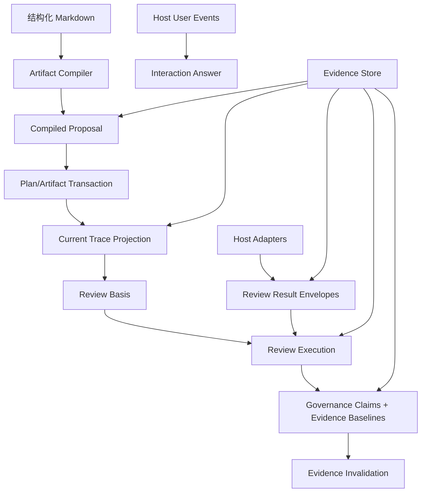

# Dev Flow 真实项目问题修复实施计划

状态：已实施，验收缺口见 `docs/plans/2026-08-17-v6验收缺口修复计划.md`  
日期：2026-08-17  
目标版本：6.0.0（破坏性版本，不兼容旧 MCP 调用或旧 active feature schema）  
问题来源：`docs/plans/gpt-dev-flow-真实项目问题清单-2026-08-16.md`  
交叉审查：`docs/plans/v4pro-实施计划审查结论-2026-08-16.md`、`docs/plans/v4flash-实施计划-修正清单-2026-08-16.md`  
覆盖范围：GPT-001～GPT-012

> 本计划是施工计划，不是行为合同。审查通过后再实施；实施完成后把稳定合同合并进 `docs/architecture.md`、`docs/routes.md`、`docs/publishing.md` 和插件 skills，再删除或归档本计划。

## 1. 目标

本轮只修复两次真实项目运行已经证实的 12 个问题，不借机增加路线、风险分类、审查角色、验证类型或用户配置。最终目标不是让单个错误消失，而是让以下完整流程在同一套证据模型下稳定跑通：

```text
结构化 Markdown
  → Core 编译 Trace
  → plan review / execution approval
  → implementation unit / checkpoint
  → 并行多视角 code review
  → verification
  → finalize
```

实施中修改计划、审查后再次修改代码、风险接受、宿主 hook 失败和长任务历史增长，都必须沿同一条主流程恢复，不能要求 agent 手工拼接第二份语义、重放内部状态或靠全量重做兜底。

### 1.1 完成定义

只有同时满足以下条件，本轮才算完成：

1. GPT-001～GPT-012 均有目标测试和至少一条跨 module 场景测试。
2. 新建 feature 可以从初始化一直完成到 finalize。
3. 实施中计划修订确认后，无需再次登记 Trace，下一步不会创建基于 stale Trace 的 review batch。
4. plan-review 与 code-review 不再互相置 stale；代码变化不会重做未变化的计划审查。
5. Claude `SubagentStop` 能把真实子代理身份及原始结构化结果绑定到 code-review job。
6. 多个审查子代理并行执行时，feature revision 不发生 claim/submit 冲突。
7. review/verification/risk acceptance 后只修改一个 UNIT 的文件，只重开该 UNIT。
8. 用户回答只从宿主事件读取；agent 改写用户原话不再成为工具输入。
9. 10,000 个 governed 文件和长历史场景下，`state.json` 不再内嵌逐路径、大输出或完整历史数组。
10. 完整验证、版本同步和受版本控制 bundle 一次性更新完成。

## 2. 已确认的设计决策

下表是本计划的强约束。实施中若发现必须违反其中任何一条，应停止并重新审查计划，不能在代码里暗设例外。

| 问题 | 决策 |
| --- | --- |
| GPT-001 | 计划修订预览冻结内容寻址提案；确认时校验 basis 并原子登记 artifact、Trace、UNIT 投影和失效集。 |
| GPT-002 | `next` 保持只读并先检查 Trace；missing/stale 时阻断，只有显式计划刷新才能继续。 |
| GPT-003 | 结构化 Markdown 是唯一真源，Trace 只能由 Core 编译。 |
| GPT-004 | Core 使用宿主无关证明合同；Claude adapter 使用真实 `session_id`、`agent_id`、`agent_transcript_path`/`last_assistant_message`；SessionStart 明示 adapter 版本与能力，旧会话 fail closed 并给出重启会话说明。 |
| GPT-005 | plan/code review 分槽；失效由 basis 变化驱动，batch 创建动作不能跨 phase 置 stale。 |
| GPT-006 | role basis 决定角色复用；全局字段分为审查语义、编排条件和捕获新鲜度，删除 `unknownDiff` 全量重审。不得为了制造复用而把全局 code role 错切成局部职责。 |
| GPT-007 | 每个内容绑定的治理声明/授权分别引用不可变 evidence baseline，由统一 module 捕获、比较并生成失效计划。 |
| GPT-008 | 删除公开 `traceDelta` 合同；所有 `TraceNodeInput` 由 Markdown parser 产生，不兼容旧调用。 |
| GPT-009 | 删除 inline verification；计划只能引用 project config 中的 named command。 |
| GPT-010 | role jobs 并行执行；宿主把原始子代理输出固化为 envelope；协调器只调用一次 complete，由 Core 批量收集并提交该 execution 的 envelope refs。 |
| GPT-011 | 采用无损冷归档、写入时打包和自动有界 orphan GC，明确替代原问题清单建议的公开 archive/compact 命令；doctor 只给出可执行的自动维护/恢复路径，不提供删除可达审计证据的入口。 |
| GPT-012 | 宿主用户事件是文本回答的唯一凭证；`answer` 不接收 agent 转述；提示从 option metadata 统一生成；同一 presentation 后最后一条未消费的同宿主事件表达用户最终意图，并且必须能被精确识别。 |

### 2.1 明确不做

- 不兼容旧 MCP 输入，不保留 alias、optional legacy 字段或双形状 validator。
- 不新增 review role、route、risk label、verification guarantee 或 classification 规则。
- 不把 `coverage-matrix`、`rollback-units` 加入新路线；v6 删除这两个没有公开登记路径的 legacy artifact kind，TEST/REC 继续位于 `implementation-plan`。
- 不实现 job 级分布式 CAS。
- 不保留 inline command 逃生口。
- 不使用模糊语义模型猜测用户回答。
- 不新增 retention UI、手动 compact 工具或历史删除配置。
- 不处理问题清单已排除的 agent 判断质量、项目 CI 配置、Playwright 环境、业务测试失败或 `file_scope` allowlist 改造。
- 不为旧 active feature 编写迁移器；旧 schema 明确 fail closed。
- 不新增 npm 依赖；压缩、hash、原子文件操作使用 Node 标准库和现有 helper。
- 不运行 `git commit`、`git push` 或创建 PR。

## 3. 总体架构

本轮把当前散落在调用方的复杂性收敛到六个深 module。公共调用方只表达意图，不再负责构造 Trace、选择基准、合并 review job、复制用户原话或管理历史文件。



| Module | 小 interface | 隐藏的实现复杂性 | 主要问题 |
| --- | --- | --- | --- |
| Artifact Compiler | `prepareArtifactRegistration(...)` | Markdown 解析、字段校验、Trace 编译、验证命令解析、执行投影、语义 hash | GPT-001/002/003/008/009 |
| Review Basis | `deriveReviewBasis(...)` | phase、role 字段归属、复用 hash、freshness guard、失效传播 | GPT-005/006 |
| Review Execution | `startReviewExecution(...)`、`completeReviewExecution(...)` | 批量 lease、capability、package、envelope、隔离证明、批量 CAS、assurance | GPT-004/010 |
| Evidence Baseline | `captureEvidenceBaseline(...)`、`prepareInvalidation(...)` | 一致快照、scope/ownership basis、file→UNIT 映射、精确 diff、保守 fallback | GPT-007 |
| Interaction Answer | `answer(...)` | presentation cursor、宿主事件、选项匹配、comment、唯一消费、领域 resolver | GPT-012 |
| Evidence Store | `put/read/seal/collect` | 内容寻址、pack/index、hot/cold、事件分段、原子 catalog、有界 GC | GPT-001/004/007/010/011 |

### 3.1 事务边界

所有“先写不可变对象，再切 state pointer”的操作使用同一事务模式：

1. 读取并校验 `expectedRevision`。
2. 捕获全部输入 basis。
3. 生成规范化不可变对象并写入 Evidence Store。
4. 再次校验易漂移的 artifact/config/workspace/host evidence。
5. 用一次 state CAS 切换 pointer、步骤状态和派生摘要。
6. CAS 失败只留下不可达对象；旧 state/pointer 仍完整可用。
7. orphan 由 Evidence Store 后续有界 GC 回收，不在业务调用中临时删除。

禁止以下模式：

- 先删 step evidence，再读取它做 diff。
- 先更新 artifact SHA，之后另一次调用才更新 Trace。
- 多个子代理分别修改同一 review ledger pointer。
- mutation 成功后再补写其所依赖的不可变文件。

## 4. 版本与数据合同

本轮是破坏性版本，统一提升到 6.0.0，不维护 5.x 双读/双写分支。

### 4.1 Schema 版本

所有持久化对象都必须在 policy 中有显式类型、严格 parser 和版本处置；不能只提升顶层 state 后继续宽松读取旧的嵌套对象。

| 持久化合同 | 当前版本 | v6 版本 | 变化/处置 |
| --- | ---: | ---: | --- |
| FeatureState | v5 | v6 | 大集合改为 pointer/summary；proposal、phase review evidence 与 Evidence Store catalog pointer 接入。 |
| TraceabilityLedger | v1 | v2 | 只接受 requirements/implementation-plan 编译来源；增加 compiler provenance、semantic SHA 和完整 slice manifest。 |
| ReviewLedger | v2 | v3 | `phase` 必填且各 phase 独立 current；加入 execution、envelope ref 和逐 job 状态。 |
| ReviewProjection | v1 | v2 | 同时投影 plan/code current，按 phase 展示 current/open/stale 和聚合结果。 |
| CheckpointManifest | v2 | v3 | blob 改为 Evidence Store pack/object ref；保持 forward/reverse、mode/kind 与验证依据。 |
| GovernanceLedger | 随 FeatureState、无独立版本 | v1 独立对象 | state 只保存 current summary/pointer；claim/authorization 引用自己的 baseline ref。 |
| InteractionLedger | 随 FeatureState、无独立版本 | v1 新增 | resolved history 移出 state；保存 pending/current pointer、response 与 consumed event ID。 |
| FeatureEventSegment | JSONL、无版本 | v1 新增 | sealed segment 带前段 hash、首尾 cursor、压缩信息；hot tail 继续追加。 |
| PlanRevisionProposal | 无 | v1 新增 | 内容寻址 proposal，绑定 artifact/requirements/Trace/config/execution basis。 |
| ReviewPackage | v2 | v3 | 绑定 phase、role semantic ref、content slice ref 和 execution requirements。 |
| ReviewExecutionRecord | 无 | v1 新增 | 绑定 request/source/job leases/generation 与 envelope refs，支持幂等恢复。 |
| ReviewResultEnvelope | 无 | v1 新增 | 绑定 execution、job/package/capability、宿主身份和原始结果。 |
| EvidenceBaselineManifest | 无 | v1 新增 | governance-record-owned snapshot、basis 与 file→UNIT 映射。 |
| EvidenceStoreCatalog / PackIndex | 无 | v1 新增 | 逻辑 ref 到 hot/cold pack 的原子索引；object 读出后校验 hash。 |
| WorkspaceLineageLedger | 随 FeatureState、无独立版本 | v1 新增 | 无界 ownership/observations/history 移出 state。 |
| VerificationLedger / RepairLedger | 随 FeatureState、无独立版本 | v1 新增 | attempt/output/progressEvidence 改为 object refs 和有界 summary。 |
| RollbackTransaction | v1 | v1 保持 | shape 不变；其引用的 checkpoint/object 通过严格 parser 读取。 |
| RollbackBackupManifest | v1 | v1 保持 | shape 不变，不因归档改写正在执行的恢复链。 |
| RollbackDriveLease | v1 | v1 保持 | shape 与恢复语义不变。 |
| RecoveryTransaction | v1 | v1 保持 | corrupt-feature 恢复日志继续独立于 feature schema。 |
| HostHealthEvent | JSONL、无版本 | v2 | 增加 adapter/plugin version 和 capability 集；旧会话记录不推断新能力。 |
| Workflow contract | v4 | v5 | 公共工具集合、artifact kind、输入 schema 和状态要求同步更新。 |
| Project config | v2 | v2 保持 | named command 与 `provides` 已存在；只删除调用方 inline 表示，不新增配置能力。 |

v6 FeatureState 不得引用旧 Trace/Review/Checkpoint/Projection；发现时返回对应 `UNSUPPORTED_*_SCHEMA`，说明必须用旧插件完成或放弃旧任务、备份 `.dev-flow` 后重新初始化。表中明确“v1 保持”的独立恢复对象继续按原 strict parser 读取；其余无版本旧嵌套数据不推断为新 ledger。不得猜测或补齐旧证据。

### 4.2 新的内容引用

state 和 ledger 只保存逻辑引用，不保存物理 pack 偏移：

```ts
interface EvidenceObjectRef {
  kind: "artifact-proposal" | "trace" | "review-ledger" | "review-package"
    | "review-execution" | "review-result"
    | "file-snapshot" | "evidence-baseline" | "checkpoint-pack"
    | "verification-log" | "repair-log" | "workspace-lineage"
    | "governance-ledger" | "interaction-ledger" | "event-segment";
  sha256: string;
  size: number;
}
```

物理位置由 feature 私有 Evidence Store catalog 解析。归档或重新打包不能迫使业务 state 改 pointer。

## 5. 结构化 Markdown 合同

所有 Trace artifact 使用同一个 block parser。anchor 继续作为 block 身份，结构化字段使用 snake_case；Core 内部编译为 camelCase `TraceNodeInput`。自由正文可以保留，但不参与机器语义。

### 5.1 Block 规则

- block 从独占一行的 `<!-- dev-flow:id=... kind=... -->` 开始，到下一个 anchor 或文件结尾结束；未闭合/畸形 anchor 聚合报错。
- anchor ID 必须满足对应 kind 的现有正则（`REQ|AC|TASK|TEST|UNIT|REC` + 至少三位数字）；同 artifact 内 ID 唯一。
- 只有匹配 `^- ([a-z][a-z0-9_]*):[ \t]*(.*)$` 的 ASCII snake_case bullet 属于机器字段；`- 描述：`、`- 验收条件：` 等全角冒号正文以及其他 Markdown 不参与机器语义。
- 一个字段在同一 block 中只能出现一次。
- 出现未知结构化字段立即报错，详情包含 artifact、block ID、字段和行号。
- 缺少必填字段一次性聚合报告，不逐个试错。
- list 字段只接受统一的 bracket 形式 `[A, B]`；禁止同时支持逗号裸列表。元素 trim 后做 Unicode NFC，空元素和重复元素报错；只有 `depends_on` 允许 `[]`，其他现有非空约束保持不变。
- scalar 字段取第一个 ASCII 冒号后的完整文本，trim 并做 Unicode NFC；枚举、ID/reference、path 与 command ID 再交给既有严格 validator。
- set 语义字段拒绝重复值并规范化排序；命令执行顺序等 sequence 语义字段保留文档顺序。
- parser 必须复用/承接现有 Core 校验：kind 与 artifact-kind 对应、ID/引用存在性、关系去重、DAG、`file_scope` 安全路径、verification disposition、command ID 与 config hash；不得在 parser 中复制一套较弱 validator。
- 未知 anchor kind、未知引用、跨 artifact 非法 node kind、空必填 list 和不安全 `file_scope` 都在一次 preflight 中聚合并带 source location。
- artifact SHA 基于原始文件字节；semantic SHA 基于规范化结构值，两者都进入 compiler provenance。

### 5.2 字段映射

| kind | Markdown 字段 | 内部语义 |
| --- | --- | --- |
| requirement | 无额外必填字段 | `RequirementNode`；描述保留在人类正文。 |
| acceptance-criterion | `parent_requirement`；可选 `verification_kind`、`verification_reason`、`verification_target` | `parentRequirement`、`verificationDisposition`。 |
| task | `covers`、`implementation_unit`；可选 `tdd` | `covers`、`implementationUnit`、`tdd`。 |
| test | `verifies` | `verifies`。 |
| implementation-unit | `tasks`、`depends_on`、`file_scope`、`covers`、`forward_verification` | 完整 UNIT 执行语义；验证项只能是 command ID。 |
| recovery | `step_ref`、`recovery_kind`、`method`、`risk_ref` | 独立恢复安排。 |

模板、skills 和测试 fixture 必须使用这套格式。标题中的 `(parent: ...)` 或自然语言描述不再作为机器字段，避免解析标题措辞。

v6 只允许：

- `requirements`：`requirement`、`acceptance-criterion`；
- `implementation-plan`：`task`、`test`、`implementation-unit`、`recovery`。

删除 `coverage-matrix`、`rollback-units`、`RollbackNode` 和对应模板/schema/legacy fixture 的正常路径；这不是新增或删减路线能力，而是清除新路线永远无法登记的 v5 遗留接口。旧 active feature 已由 v6 总体策略拒绝，不保留内部双读。

### 5.3 Verification 规则

- `VerificationCommandRef` 收敛为 command ID；删除 `InlineVerificationCommand`。
- plan compiler 解析每个 ID 对应的 project command，校验存在性和 command hash。
- 每个 implementation unit 的 `forward_verification` 必须非空，且其中每一条 named command 的 `provides` 都必须包含 `targeted`；混合引用 targeted 与 non-targeted command 也必须失败。
- compiler 一次性返回全部 `{unitId, commandId, missingGuarantee}`，正式登记和预检使用同一诊断。
- checkpoint 仍保留防御性 current/config/targeted 检查，防止磁盘或 pointer 损坏；正常流程不应首次在 checkpoint 才发现问题。

## 6. 分阶段施工计划

### Phase 0：建立破坏性合同基线和可逐步启用的测试骨架

目标：先锁定 v6 interface、删除会把旧缺陷继续当成正确行为的 fixture，但不把尚未实现的 12 组失败测试长期放进全量测试集。

施工：

1. 新增 v6 测试 helper：先写结构化 Markdown，再让 Core 编译；不允许测试直接制造计划 `traceDelta`。
2. 改写 `tests/helpers/trace-fixtures.mjs`：仅保留对损坏/旧 schema 的底层构造；正常路线 fixture 走公开 artifact interface。
3. 建立 `v6-*` 测试文件和最小主流程 fixture，未进入对应 Phase 的行为先用 `test.todo` 标识，不允许以普通失败用例污染全量测试。
4. 每个后续 Phase 开始时启用本 Phase 的 todo，使目标测试先因明确缺失 interface/行为失败；实现后必须转绿，Phase 退出时仓库不得遗留已启用的 known-red。
5. 将“确认后 Trace 不变”、unknownDiff 全量重审、虚构 `parent_session_id`、inline 自动 targeted、`dev_flow_answer.userReply` 等旧期望列入删除/改写清单，不保留 v5/v6 相反断言。

主要测试文件：

- `tests/unit/v6-artifact-compiler.test.mjs`
- `tests/unit/v6-plan-revision-transaction.test.mjs`
- `tests/unit/v6-review-phase-basis.test.mjs`
- `tests/unit/v6-review-execution-envelope.test.mjs`
- `tests/unit/v6-evidence-baseline.test.mjs`
- `tests/unit/v6-evidence-store.test.mjs`
- `tests/unit/v6-interaction-answer.test.mjs`
- `tests/e2e/routes/v6-real-project-flow.test.mjs`

退出条件：测试骨架、真实 fixture 和旧测试处置清单可用；`npm run typecheck`、`npm run test:unit` 保持绿色。后续每个 Phase 都遵守“启用目标测试为红 → 实现 → 全量 unit 绿”的本地闭环。

### Phase 1：Evidence Store 基础 seam（GPT-011 基础）

目标：后续 proposal、Trace、review envelope 和 baseline 从第一天就使用最终内容存储，避免每个 module 自建 snapshot 目录。

新增/调整：

- 新增 `plugins/dev-flow/src/policy/evidence-store.ts`：object ref、catalog、pack index 的持久化类型与严格 parser。
- 新增 `plugins/dev-flow/src/core/evidence-store.ts`：业务调用唯一入口。
- 新增 `plugins/dev-flow/src/core/evidence-pack.ts`：pack 编码、压缩、索引、校验和原子 seal；保持内部 seam，不导出给业务调用方。
- 新增 `plugins/dev-flow/src/core/workspace-snapshot.ts`：一次遍历捕获规范化 path/content SHA/mode/kind/symlink；作为 Evidence Store 内部 seam，由 Phase 3 code role 与 Phase 6 baseline 共用。
- `state-store.ts` 接入 catalog pointer，但本阶段不一次性搬迁全部旧字段。

实现要求：

1. `putObject(kind, canonicalBytes)` 按内容 SHA 幂等写入；相同对象不重复存储。
2. checkpoint 一次写入的多个 blob 直接形成一个不可变 pack，不能先制造 N 个 loose file 再压缩。
3. pack index 包含 object SHA、kind、offset、compressed length、raw length；读出后重新 hash 验证。
4. catalog 使用 write-temp → fsync → rename；pack/index 完成并校验后才能切 catalog。
5. `readObject(ref)` 对 hot/cold 位置透明。
6. `sealHistory` 只移动物理位置，不改变逻辑 ref。
7. `collectOrphans` 必须接受已计算的 root set，每次最多处理固定对象数/字节数，默认预算写成常量并覆盖测试。
8. 任一 fault point 失败时，现有 catalog 和 current state 仍可读取；新文件最多成为 orphan。
9. `captureWorkspaceSnapshot(scope)` 在同一遍历中产生 canonical manifest 与 object ref；调用方不能分别调用 fingerprint/file-list 再自行拼接“同一时刻”的证据。

测试：

- 同内容去重、不同 kind 不混淆。
- pack 写入前/后、index rename 前/后、catalog 切换前/后 fault injection。
- pack 损坏、index 越界、hash 不符 fail closed。
- seal 前后同一 object ref 可读。
- bounded GC 不删除 root 可达对象，并在多轮调用后删除全部 orphan。

退出条件：后续 module 可以只依赖 object ref，不需要知道 `review/snapshots`、`traceability/snapshots` 或 blob 文件路径。

### Phase 2：Artifact Compiler 与公共工具收敛（GPT-003、GPT-008、GPT-009）

目标：Markdown 成为唯一输入，删除公开 Trace node 合同和 inline verification。

主要文件：

- `plugins/dev-flow/src/core/traceability-anchors.ts`
- `plugins/dev-flow/src/core/plan-graph.ts`
- `plugins/dev-flow/src/core/plan-compiler.ts`
- `plugins/dev-flow/src/core/plan-compile-context.ts`
- `plugins/dev-flow/src/core/artifacts.ts`
- `plugins/dev-flow/src/core/artifact-templates.ts`
- `plugins/dev-flow/src/core/traceability.ts`
- `plugins/dev-flow/src/policy/traceability.ts`
- `plugins/dev-flow/src/mcp/dispatch.ts`

施工：

1. 用一个 block parser 替代“anchor 解析一份、plan graph 再解析一份”的重复逻辑。
2. parser 输出带 source location 的规范化 `TraceNodeInput[]`；Core-owned source 字段只在编译时附加。
3. 新建 `prepareArtifactRegistration(root, featureId, kind, nextStateRevision)`：统一读取 artifact、project config、current Trace 并调用纯 compiler。
4. compiler 返回 `CompiledArtifactProposal`：
   - artifact path/raw SHA/semantic SHA；
   - compiler schema/version；
   - 新 ledger；
   - implementation-unit runtime projection；
   - execution semantic basis hash；
   - verification command hashes；
   - 聚合 diagnostics。
5. `record_artifact` 根据 route/kind 自动选择普通登记或 Trace 编译登记；删除公开 `record_artifact_with_trace`。
6. `validate_plan` 只读取已编辑的 Markdown，不接收 delta。
7. `revise_plan` 只接收 feature/revision/host，不接收 delta。
8. 删除 MCP `traceDeltaSchema`、`traceNodeSchemas` 和 `InlineVerificationCommand`。
9. v6 只保留 requirements、implementation-plan 两类 Trace artifact 并统一从 Markdown 编译；从公开 kind enum、policy type、模板和 v6 fixture 删除 coverage-matrix/rollback-units 及其不可达 node。
10. 不保留旧工具 alias 或 legacy 参数分支。

重点测试：

- 每种 block 的必填、可选、未知、重复字段和 line diagnostics。
- TASK `tdd=test-first/direct` 从 Markdown 到 Trace 再到 compiler 约束。
- 仅修改 Markdown 字段会改变 semantic SHA 和 Trace；仅改非结构化正文只改变 raw SHA，按现有 artifact 审查规则处理。
- 不存在任何 `artifactChanged:false, traceChanged:true` 的计划语义登记路径。
- inline object 在 Markdown、MCP 和 Core type 三层均不存在。
- non-targeted named command 在 validate/record/revise 阶段聚合失败，checkpoint 不启动。
- UNIT 同时引用 targeted + non-targeted command 时同样聚合失败，不得以“至少一个 targeted”放行。
- tools/list 不暴露 `traceDelta` 或 `record_artifact_with_trace`。

退出条件：所有正常 Trace fixture 都由 Markdown 生成；仓库搜索不到公开 `traceDelta` 和 inline verification 用法。

### Phase 3：Review phase 与 role basis 重建（GPT-005、GPT-006）

目标：先提供 Phase 4 原子计划修订所依赖的 phase-aware 失效合同；plan/code 证据按真实依赖共存，复用只由明确负责该语义的 role basis 决定。

主要文件：

- `plugins/dev-flow/src/core/review-jobs.ts`
- `plugins/dev-flow/src/core/review-store.ts`
- `plugins/dev-flow/src/core/review-projection.ts`
- `plugins/dev-flow/src/core/inspection.ts`
- `plugins/dev-flow/src/policy/review.ts`
- `plugins/dev-flow/src/core/feature-check.ts`
- `plugins/dev-flow/src/mcp/doctor.ts`

ReviewLedger v3 invariant：

- `batch.phase` 必填。
- 每个 phase 最多一个 `validity=current` batch；plan/code 可以同时 current。
- batch 创建本身不传播失效。
- 同 phase semantic basis 改变时替换该 phase current；plan semantic basis 改变时显式向下失效 code，code 变化绝不反向失效 plan。
- planning evidence 只能引用 current、complete、phase=plan、basis matching 的 batch。
- code_review evidence 只能引用 current、complete、phase=code、basis matching 的 batch。
- `prepareReviewInvalidation(before, after)` 是纯函数，返回要 stale/restamp/reopen 的明确计划；Phase 4 只消费该结果，不重新实现 review 规则。

Basis 分层：

1. `RoleSemanticBasis`：该角色真正审查的规范化语义与内容引用。
2. `ReviewOrchestrationBasis`：feature/phase、required jobs、review depth、执行来源与隔离要求。
3. `CaptureFreshnessBasis`：artifact/config/workspace/host 捕获前后的漂移检查，不直接参与角色复用。

v5 `ReviewBasis` 字段必须按下表全部处置；实现使用带 `satisfies` 的 typed ownership map，使新增字段未归属时 typecheck 失败：

| v5 字段 | v6 归属 | 规则 |
| --- | --- | --- |
| `featureId` | orchestration identity | 禁止跨 feature 复用；写入 package/envelope identity。 |
| `route` | orchestration；派生语义进入 role | route 决定 required jobs；真正影响审查的 level/topology 等进入具体 role。 |
| `workflowCapabilities` | orchestration | 决定 phase、隔离和门禁，不以整对象污染所有 role hash。 |
| `classification.level/topology/requirements` | role semantic | 只进入职责相关的 plan role；code role 只读取其 package 所需的稳定投影。 |
| `classification.riskLabels` | orchestration + specialty role semantic | 决定 depth/专项角色；每个专项角色只绑定自己的 label 集。 |
| `artifacts` | capture freshness + role semantic refs | raw SHA 用于漂移检查；各角色绑定所需 artifact semantic SHA。 |
| `traceability` pointer/revision | capture freshness | role 绑定规范化 Trace slice ref，而不是 ledger pointer/revision。 |
| `projectConfigSha256` | capture freshness | 整体 SHA 只防捕获漂移；角色只绑定实际引用的 command/config slice。 |
| `verificationCommandHashes` | role semantic | 仅被相应 Trace slice 引用的 command hash 进入对应角色。 |
| `scopeManifestSha256` | role semantic + freshness | architecture/rollback 与 code content manifest 绑定规范化 scope；原始 manifest SHA 负责漂移检查。 |
| `governedRootsFingerprint` | capture freshness | 不触发 plan role 重审。 |
| `featureOwnedFingerprint` | 删除平铺字段 | 改为 code role 自己的 `contentSliceRef`；不得作为未知全局 diff。 |

11 个现有角色逐项定义如下，不新增角色：

| phase | role | `RoleSemanticBasis` |
| --- | --- | --- |
| plan | `requirements-coverage` | requirements/plan semantic SHA，REQ/AC/TASK/TEST/UNIT slice，非行为 disposition。 |
| plan | `architecture-testability` | plan semantic SHA，TASK/TEST/UNIT、topology/scope、被引用 command hash。 |
| plan | `rollback-operability` | plan semantic SHA，TASK/UNIT/REC、recovery controls、被引用 command hash；v6 不再含 RU。 |
| plan | `security` | security label + 完整 plan semantic Trace slice；风险未细分到 UNIT 前不做伪精确文件切片。 |
| plan | `data-irreversibility` | data/irreversible labels + 完整 plan semantic Trace slice。 |
| plan | `money-safety` | money label + 完整 plan semantic Trace slice。 |
| plan | `contract-failure` | external label + 完整 plan semantic Trace slice。 |
| plan | `recovery-observability` | availability label + 完整 plan semantic Trace/recovery slice。 |
| plan | `critical-correctness` | critical_correctness label + 完整 plan semantic Trace slice。 |
| code | `code-quality` | 当前全部 feature-owned governed file 的 canonical snapshot ref、mode/kind/symlink 与 code-review scope。 |
| code | `requirement-fidelity` | 与 code-quality 相同的内容集合 + requirements/AC/TASK/UNIT 语义映射。 |

code role 当前职责是 feature 级而不是 UNIT 级，所以一次受治理代码变化可以合法地使两个 code role 都重审；本轮不发明“文件属于哪个审查视角”的新领域数据。两个 code role 的 `contentSliceRef` 与 Phase 6 baseline 必须引用 Phase 1 同一 canonical workspace snapshot 机制，不能再次独立 fingerprint。将来只有角色职责本身获得更窄、机器可证明的 scope 时，才允许收窄 `contentSliceRef`。本轮必须保证：纯代码变化不触发任何 plan role；任何 role 的 `RoleSemanticBasis` 完全相等时必须复用。

施工：

1. batch identity 改为 `featureId + phase + orchestration basis + ordered(role, depth, roleSemanticHash)`。
2. 删除 `unknownDiff`、`unknownDiffInfo` 和“全角色相等但仍禁止复用”的分支。
3. 新增 typed ownership map 与表驱动测试；全局字段若影响审查，必须先投影到现有角色，freshness/orchestration 字段不能偷偷进入 role hash。
4. 创建 code batch 不 stale plan batch；代码变化只 stale code。
5. plan semantic basis 变化 stale plan 和下游 code；相同 basis 重做 batch 不影响另一 phase。
6. 新 plan batch 成为 current 时原子重开 planning；完成并登记后 restamp planning evidence。
7. status/inspect/review projection 同时展示 plan/code current 摘要，默认只展开当前步骤对应 phase。

重点测试：

- plan 通过 → implementation → code review：plan batch 仍 current。
- code finding 修复 → implementation：plan evidence 与所有 plan role 保留；两个全局 code role 按变更后的内容重审。
- plan 语义变化：plan/code 都 stale。
- project 新增无关 verification command：所有 role hash 不变。
- topology/scope/被引用 command 分别只影响表中归属角色；源码变化不影响 plan role。
- 所有 role hash 相等时全部复用，不存在 unknown 全量重审。
- type-level/table test 枚举全部 ReviewBasis 字段与 11 个 ReviewRole。
- state validator/doctor 报告 stale、wrong-phase 或 basis-mismatch 的 planning/code evidence。

退出条件：phase invalidation pure interface 已稳定，真实 TanStack 类序列不再因 code batch/代码变化重建 plan batch；Phase 4 可以直接消费失效计划。

### Phase 4：原子计划修订与 Trace current gate（GPT-001、GPT-002）

目标：用户确认的提案与最终落账内容完全一致，review 绝不能在缺失/stale plan slice 上开始。

新增 policy 类型（禁止 `unknown` 投影）：

```ts
interface PlanRevisionProposal {
  schemaVersion: 1;
  featureId: string;
  artifact: { path: string; rawSha256: string; semanticSha256: string };
  basis: {
    stateRevision: number;
    currentTraceSha256: string;
    requirementsArtifactSha256: string;
    requirementsSemanticSha256: string;
    requirementsSliceSha256: string;
    projectConfigSha256: string;
    executionSemanticBasisHash?: string;
  };
  compiledTrace: EvidenceObjectRef;
  implementationProjection: ImplementationRuntimeProjection;
  impact: {
    affectedUnits: string[];
    redoUnits: string[];
    sideEffectUnits: string[];
    invalidatedPhases: Array<"plan" | "code">;
  };
}
```

`ImplementationRuntimeProjection` 放在 policy，使用 strict parser，字段只覆盖当前 UNIT 执行所需的规范化 tasks/dependencies/file scope/verification/recovery refs；不得把 compiler 的任意中间对象透传进持久化 proposal。

施工：

1. `revisePlanDuringImplementation` 调用 Phase 2 的唯一 compiler，写 proposal object，interaction 只保存 proposal ref 和公开 impact。
2. preview 的影响集由 compiled old/new projection 计算并写入 proposal；不再对调用方 delta hash。
3. 确认时重新校验 state revision、plan raw/semantic SHA、requirements raw/semantic/slice SHA、project config SHA、current Trace SHA 和 execution basis。
4. 一次 `mutatePrepared` 同时更新 artifact 登记、Trace pointer、UNIT runtime projection、受影响 UNIT、Phase 3 生成的 review invalidation plan 及受影响步骤。
5. 取消只解决 interaction，不更新任何业务 pointer。
6. basis 漂移返回 `PLAN_REVISION_STALE` 并列出漂移种类；不自动重编译另一份提案。
7. `assertImplementationPlanTraceCurrent` 改为完整 slice invariant：
   - 必须存在 current plan slice；
   - slice artifact/semantic SHA 与 current artifact 相同；
   - compiler provenance 受支持；
   - source manifest 与 artifact block 集一致；
   - referenced requirements/config command slice current。
8. 空 slice 返回 `TRACE_SLICE_MISSING`，有 slice但 basis 不同返回 `TRACE_SLICE_STALE`。
9. `next` 在任何 plan review 调度之前执行 gate；失败只返回“刷新计划”，不得创建 batch。

重点测试：

- 预览后立即确认，再立即 `create_review_batch` 成功且没有中间 stale Trace。
- 预览 impact 与最终 old/new compiled projection diff 完全相等。
- 预览后修改 plan/config/requirements/current Trace 任一项，确认整笔失败且 pointer 不变。
- requirements 重登记使 plan slice stale 后，`next` 和直接 create plan batch 都阻断。
- 零 current plan node 不再通过。
- side-effect unit 继续保持显式重跑确认，不因本次原子化被弱化。

退出条件：删掉“计划修订后请手工 record_artifact_with_trace”的全部 recovery 文案与测试；Phase 4 全量 unit 绿色。

### Phase 5：宿主结果信封与批量 Review Execution（GPT-004、GPT-010）

目标：多个 role 可以真正并行读取/执行，正常路径只用 start/complete 两次 feature CAS；Core 保留每份独立原始结果并在全部完成后生成一份聚合投影。

主要文件：

- `plugins/dev-flow/src/core/review-jobs.ts`
- 新增 `plugins/dev-flow/src/core/review-execution.ts`
- 新增 `plugins/dev-flow/src/policy/review-execution.ts`
- `plugins/dev-flow/src/hosts/review-execution-adapter.ts`
- `plugins/dev-flow/src/hosts/hook-adapter.ts`
- `plugins/dev-flow/src/hosts/host-health-adapter.ts`
- `plugins/dev-flow/src/hosts/bash-syntax.ts`
- `plugins/dev-flow/hosts/claude/hooks.json`
- `plugins/dev-flow/hosts/codex/hooks.json`
- `plugins/dev-flow/src/core/host-health.ts`
- `plugins/dev-flow/src/mcp/dispatch.ts`
- `plugins/dev-flow/src/mcp/doctor.ts`

最终执行合同：

- `ReviewExecutionMode` 只保留字面量 `parallel-execution`，含义是“role work 可并行，feature ledger 由协调器批量落账”，不再混合描述证明来源。
- 证明来源独立为 `ReviewExecutionSource = "claude-subagent" | "server-sampling"`，逐 execution/envelope 记录；删除 `isolated-sequential`、`parallel-safe`、`native-subagent`、`mcp-sampling` 四个混合语义值。
- Claude 在当前 SessionStart 明示 `review-result-envelope-v1` 能力时走真实 SubagentStop envelope；Codex 当前没有等价的可信子代理完成事件，v6 明确只走 server sampling，不把普通 Stop/agent 自报伪装成等价证明。
- 无宿主 envelope 能力且 MCP client 也不支持 sampling 时，plan/code review 都返回 `REVIEW_EXECUTION_UNAVAILABLE`。若现有 policy 允许 quality exception，只能由用户显式接受该缺口并写独立 authorization/baseline；不得自动降级为主 agent 直接 submit，也不得把例外显示为 review complete。

v6 工具迁移表：

| v5 工具 | v6 处置 | 说明 |
| --- | --- | --- |
| `dev_flow_create_review_batch` | 保留 | 只创建 phase-aware immutable batch，不 claim job。 |
| `dev_flow_get_review_job` | 保留只读 | capability 只能读取单个 immutable package。 |
| `dev_flow_rebuild_review_projection` | 保留 | 重建 phase-aware projection。 |
| `dev_flow_start_review_execution` | 新增 | 一次领取当前可执行 jobs，建立 execution 与 leases。 |
| `dev_flow_complete_review_execution` | 新增 | 一次验证并批量提交当前 execution 的 envelopes。 |
| `dev_flow_claim_review_job` | 删除 | 被 batch start 取代。 |
| `dev_flow_release_review_job` | 删除 | 失败/超时由 execution 状态机恢复。 |
| `dev_flow_start_isolated_review` | 删除 | declaration/marker 在 batch start 内生成。 |
| `dev_flow_submit_review_job` | 删除 | 子代理不再直接 mutation。 |
| `dev_flow_sample_review_job` | 删除公开工具 | server sampling 由 batch execution module 并行驱动并写同形 envelope。 |
| hidden `dev_flow_record_review_execution_event` | 删除 | host adapter 直接通过内部 seam 写 immutable envelope/diagnostic，不暴露 MCP mutation。 |

公共工具：

1. `dev_flow_start_review_execution`
   - 输入：featureId、expectedRevision、batchId、host、unguessable executionRequestId。
   - Core 根据 SessionStart capabilities 选择允许的 source；调用方不能自报隔离能力。
   - 一次 CAS claim 当前 batch 的全部 pending/可重试 jobs，并写一个 execution record。
   - host-subagent 路径为每个 job 返回独立 capability、package ref、declaration marker、lease；server-sampling 路径由同一 module 并行发起 sampling 并固化 envelope。
   - 同 requestId 重试幂等。
2. `dev_flow_get_review_job`
   - 保留只读、单 capability 可见性；子代理只能读自己的 immutable package。
3. `dev_flow_complete_review_execution`
   - 输入：featureId、expectedRevision、batchId、executionRequestId；不得只凭 batchId 扫描所有历史 envelope。
   - Core 只发现并校验绑定该 execution 的未提交 envelopes，验证 capability/package/basis/scope/finding/isolation/attestation 和 job 唯一性，再一次 CAS 写 ledger。
   - 正常路径等全部 job 捕获后一次 complete；恢复路径可以先提交合法子集，未完成 job 保持 open，public projection 在 batch complete 前仍隐藏全部 sibling findings。

job/execution 状态机：

```text
pending
  └─ start(CAS) → leased
       ├─ valid host/sampling result → envelope-captured
       │    └─ complete(CAS) → submitted
       ├─ explicit failed envelope → complete(CAS) → pending
       └─ lease expired and no valid envelope → next start(CAS) → leased(new execution)
```

- 单 job 重跑保持原 batchId，不 stale/重置其他 job，不丢已 submitted job。
- 新 execution 不能消费旧 execution 的 envelope；`executionRequestId`、jobId 和 lease generation 同时绑定。
- 完成事件时间不晚于 lease expiry 即可接受；协调器晚调用 complete 不把已及时完成的结果误判超时。
- 捕获 envelope 不推进 feature revision；只有 start/complete 改 ledger/state。协调器崩溃后可用同 executionRequestId 幂等恢复。

`ReviewResultEnvelope` 至少包含：

- batchId、jobId、role、package SHA、capability hash；
- executionRequestId、lease generation、declarationId；
- source、host、host event ID；
- parent context、child context、agent ID；
- started/completed time 与 lease basis；
- raw result SHA、parsed completion SHA、Evidence Store result ref。

Claude adapter：

1. `HookEvent` 增加真实 `last_assistant_message`。
2. `session_id` 映射 implementation/parent context。
3. `agent_id` 映射 isolated child context。
4. marker 从 `last_assistant_message` 或 `agent_transcript_path` 恢复并唯一绑定 declaration。
5. 从最后一条结构化 review completion 解析结果；保存原始 bytes/hash 与规范化 payload。
6. `missing-marker`、`unknown-declaration`、`missing-context-ids`、`same-context`、`invalid-completion` 都写 diagnostic event。
7. code phase 只有宿主捕获或 server sampling envelope 能满足隔离；agent 自报仍不合格。
8. lease 以宿主完成事件时间判断，不能因协调器稍后 finalize 而错误过期。
9. SessionStart health signal 写入 plugin/adapter version 与 capabilities；start 前检查当前会话已经装载 `review-result-envelope-v1`，旧会话返回“更新插件后重新开启会话并重试原 execution”的具体说明。

可见语义：

- `parallel-execution` 只描述执行/落账并发合同，assurance 只由 envelopes 的真实来源派生。
- incomplete batch 继续隐藏 sibling findings。
- 每个 job 保留独立 submission hash/findings/provenance；Core 只汇总 progress、blocker 和 assurance。
- 某个子代理失败只重跑该 job；已捕获 envelope 不因协调器崩溃丢失。
- plan/code 共用 execution module；plan 不要求 context isolation，code 要求 host child/parent 不同或独立 sampling 证明。

重点测试：

- 使用官方真实 Claude `SubagentStop` payload fixture，不出现虚构 `parent_session_id`。
- 4 个 jobs 一次 claim、并行产生 4 个 hook envelope、一次 complete，无 revision conflict。
- 同 batch 连续两次 execution 时，旧 execution envelope 不能混入新 complete。
- parent 与 child context 相同、marker 不匹配、结果格式错误均 fail closed 且 doctor 可见。
- parent 构造不同 completion 不能替代宿主捕获 payload。
- 一个 job 超时/失败时，其余 envelope 可提交，batch 保持 open。
- 超时 job 用新 executionRequestId 单独重跑，batchId 和其他 job submission 不变。
- incomplete batch 不泄露 sibling findings；complete 后统一展示。
- plan phase 与 code phase 使用同一 execution module，但 code phase 强制隔离证明。
- Claude 新会话能力正常、旧会话缺能力、Codex sampling 成功、Codex 无 sampling 显式 blocked 四条 host×source 路径。

退出条件：tools/list 与 skills 不再出现旧 review mutation；真实 Claude hook 能完成证明链，Codex 有明确 sampling/blocked 路径，任何路径都不会要求子代理直接写 feature state。

### Phase 6：Evidence Baseline 与精确失效（GPT-007）

目标：门禁状态与内容基准分离；review、verification、risk acceptance 各自拥有独立 basis，reconcile 永远先计算再删除。

主要文件：

- 新增 `plugins/dev-flow/src/core/evidence-baseline.ts`
- 新增 `plugins/dev-flow/src/policy/evidence-baseline.ts`
- `plugins/dev-flow/src/core/change-invalidation.ts`
- `plugins/dev-flow/src/core/ownership-workflow.ts`
- `plugins/dev-flow/src/core/feature-check.ts`
- `plugins/dev-flow/src/core/verification.ts`
- `plugins/dev-flow/src/core/quality-exceptions.ts`
- `plugins/dev-flow/src/policy/governance-records.ts`
- `plugins/dev-flow/src/mcp/doctor.ts`

数据模型：

- 每个 `review-complete`、`verification-current` claim 和内容绑定的 `risk-acceptance` authorization 必须引用自己的 baseline manifest。
- step evidence 只引用 claim/batch/attempt，不拥有 snapshot 生命周期。
- baseline manifest 引用一个去重后的 canonical file snapshot，并记录：
  - feature-owned fingerprint；
  - governed scope hash；
  - ownership hash；
  - plan execution basis hash；
  - current checkpoint IDs；
  - file→UNIT[] 映射；
  - origin governance record/target/time。
- 不设置单一“latest accepted baseline”。

捕获：

1. 从同一规范化 file snapshot 派生 fingerprint、mode/type/symlink 和 scope 摘要。
2. 捕获前后执行 drift guard；不允许 snapshot 与 fingerprint 分别读取出两种工作区状态。
3. snapshot SHA 基于完整规范化内容，不再用 feature fingerprint 当文件名。
4. 写 object/manifest 成功后，claim/authorization 与 pointer 在同一 state CAS 中落账。
5. risk acceptance 产生 `risk-accepted` provenance，不冒充通过；不得重写 `startBusinessFingerprint`。
6. `startBusinessFingerprint` 只保留“feature 启动时工作区事实”的审计含义；从 `change-invalidation.ts` 删除它作为 current change baseline 的全部 fallback 消费。所有精确/保守失效都由 governance-record-owned baseline manifest 决定。

失效：

1. `prepareInvalidation` 收集所有仍参与当前门禁的 content-bound claims/authorizations。
2. 分别比较当前内容与各自 baseline；需要失效的变化文件取并集。
3. 使用 baseline 捕获时的 file→UNIT[] 映射；一个文件属于多个 UNIT 时全部重开。
4. 比较 path、content SHA、mode、kind、symlink target，覆盖新增、删除、rename/type change。
5. scope/ownership/plan basis 不兼容、snapshot 损坏或变化文件无法映射时，返回带原因的 conservative fallback。
6. `reconcileWorkspace` 在 mutation 前准备完整 `InvalidationPlan`，一次 CAS 同时更新 workspace lineage、UNIT、steps、claims currency 和 `lastInvalidation`。
7. reconcile 本身不能推进 baseline；只有新的成功 review/verification 或用户风险接受才能产生新 baseline。

重点测试：

- 五个 checkpoint 完成并 code review 通过，只改 UNIT-003 文件，reconcile 只重开 UNIT-003。
- review 在 F1、verification 在 F2，各自 baseline 都保留且各自正确失效。
- review/verification/checkpoint quality exception 分别捕获 baseline，不互相覆盖。
- risk acceptance 后再次改动，只重开实际受影响 UNIT，并使旧授权 stale。
- risk acceptance 不改 `startBusinessFingerprint`，后续变化仍通过该 authorization 自己的 baseline 精确失效，不退回 feature-start 全局比较。
- ownership/governedRoots/plan basis 改变时不错误使用旧映射。
- symlink↔file、mode、rename、delete 和一个文件由多个 UNIT 修改。
- snapshot 写成功但 state CAS 失败只产生 orphan。

退出条件：`recordedBaseline` 的“verification 优先、review 次之、risk 最后”选择函数和 `startBusinessFingerprint` 的 current-diff fallback 都被删除；step 删除不会让 baseline 不可达。

### Phase 7：宿主事件唯一回答与统一提示（GPT-012）

目标：删除 agent 手抄用户原话的输入，保留严格来源与唯一消费。

主要文件：

- `plugins/dev-flow/src/core/interaction-answer.ts`
- `plugins/dev-flow/src/core/interaction-provenance.ts`
- `plugins/dev-flow/src/core/user-interactions.ts`
- `plugins/dev-flow/src/core/decision-interactions.ts`
- `plugins/dev-flow/src/core/decision-language.ts`
- `plugins/dev-flow/src/core/text-normalization.ts`
- `plugins/dev-flow/src/core/grill-interaction.ts`
- `plugins/dev-flow/src/core/decision-workflow.ts`（decision-ratification、decision-revision）
- `plugins/dev-flow/src/core/plan-revision.ts`（plan-revision、side-effect-rerun）
- `plugins/dev-flow/src/core/requirements-grill.ts`（grill）
- `plugins/dev-flow/src/core/approval-interactions.ts`（approval）
- `plugins/dev-flow/src/core/ownership-workflow.ts`（workspace-ownership、task-switch）
- `plugins/dev-flow/src/core/route-workflow.ts`（route-confirmation）
- `plugins/dev-flow/src/core/quality-exceptions.ts`（quality-exception）
- `plugins/dev-flow/src/core/acceptance.ts`（acceptance-confirmation）
- `plugins/dev-flow/src/core/rollback.ts`（rollback-confirmation）
- `plugins/dev-flow/src/core/review-jobs.ts`（risk-acceptance）
- `plugins/dev-flow/src/mcp/interaction-pipeline.ts`
- `plugins/dev-flow/src/mcp/dispatch.ts`
- `plugins/dev-flow/src/mcp/doctor.ts`

施工：

1. `dev_flow_answer` schema 删除 `userReply`；文本路径只接 featureId、expectedRevision、host。
2. `AnswerCredential` 的 text 形态改为 Core 内部的 host-event credential，外部 caller 不提供原文/action/comment。
3. Core 从 presentation cursor 之后查找同 host、未消费的 user-prompt events，并用确定性 option matcher 解析原始文本。
4. matcher 按以下固定优先级解析单条事件，不使用 embedding/LLM/自然语言近似：
   - native form 的 option id 精确匹配；
   - text 的 `answerCode` 精确匹配（只做 NFKC、trim、既有大小写归一）；
   - option id 或完整 label 精确匹配；输入中只允许剥离 renderer 自己追加的 `（推荐）` 后缀；
   - renderer 规定的 `answerCode/label：comment` 格式，精确匹配前半部分后提取非空 comment；
   - 存在专门 other option 时，`其他：<comment>` 精确前缀提取；
   - 其余均为 not recognized，并继续保留现有否定词/前缀防误匹配保护。
5. 若 presentation 后有多条事件，按 ledger cursor 只取最后一条未消费的同宿主事件作为用户的纠正/最终意图，再按第 4 条精确解析；最后事件不识别时 fail closed，不能回退到更早的“看起来可用”答案。只消费获选 event ID；更早事件因早于下一次 presentation cursor 而不能复用于后续 interaction。这一 last-event-wins 规则是 v6 明确决策，不再沿用依赖 caller `userReply` 才能消歧的 v5 AMBIGUOUS 分支。
6. renderer 在 presentation 前验证 answerCode、option id、规范化 label 唯一；元数据自身冲突返回 `INTERACTION_OPTIONS_INVALID`，不能靠事件顺序猜选项。
7. native elicitation 继续使用宿主结构化 selection/comment，由 interaction pipeline 直接形成可信 credential。
8. 13 个 resolver 只消费统一 credential，不再各自调用 `resolveInteractionPromptEvent(...userReply)`；每个 resolver 至少有一条 host-event credential 集成测试。
9. 统一 presentation renderer 从 options 自动生成：label、description、recommended、answer code、`requiresComment` 和示例格式。
10. question 保留领域语境，回答格式不能由各 kind 手写后与 metadata 漂移。

错误分型：

- `INTERACTION_EVENT_MISSING`：没有呈现后的同宿主事件；只有 doctor 确认 hook 异常时才建议修 hook。
- `INTERACTION_REPLY_NOT_RECOGNIZED`：有事件但不匹配选项；返回合法格式。
- `INTERACTION_COMMENT_REQUIRED`：选中 requiresComment 但原始事件无理由。
- `HOST_EVENT_HOST_MISMATCH`：有效事件属于另一 host。
- `INTERACTION_EVENT_REPLAY`：已消费 event 只能对原 interaction 做幂等读取，不能复用到另一 interaction。
- `INTERACTION_OPTIONS_INVALID`：renderer/matcher 发现重复 code/id/规范化 label；在呈现前阻断。

重点测试：

- 用户事件“确认路线”，agent 无法再传“确认这条路线”；answer 直接成功。
- 有唯一事件但文本不识别时不建议 doctor。
- 连续发送两个不同的合法选项时最后一条获选；合法答案后再发送无法识别文本时整笔失败且不回退到旧答案；旧事件不能被下一 interaction 复用。
- `A（推荐）`、`A`、精确 label、`其他：<理由>`、requiresComment 缺理由和否定前缀分别命中上述确定规则。
- 零事件且 hook 健康/不健康的恢复说明不同。
- quality exception 的首次公共 presentation 明示必须提供理由及示例。
- 所有 interaction kind 通过同一 answer interface；不再在 resolver 测重复 provenance 细节。
- 跨宿主、早于 presentation、已消费事件继续 fail closed。

退出条件：公开 schema、skills 和 13 个 Core resolver 中不存在 agent 提交的 `userReply` 或重复 provenance 解析；统一 matcher/renderer 是唯一文本合同。

### Phase 8：Live state 瘦身、冷归档和自动 GC（GPT-011 收口）

目标：把 Phase 1 的 Evidence Store 应用于所有无界集合，并建立可测的存储预算。

主要文件：

- `plugins/dev-flow/src/policy/evidence-store.ts`
- `plugins/dev-flow/src/core/evidence-store.ts`
- `plugins/dev-flow/src/core/evidence-pack.ts`
- `plugins/dev-flow/src/core/state-store.ts`
- `plugins/dev-flow/src/core/inspection.ts`
- `plugins/dev-flow/src/core/user-interactions.ts`
- `plugins/dev-flow/src/core/interaction-provenance.ts`
- `plugins/dev-flow/src/core/verification.ts`
- `plugins/dev-flow/src/core/verification-store.ts`
- `plugins/dev-flow/src/core/repair-loop.ts`
- `plugins/dev-flow/src/policy/governance-records.ts`
- `plugins/dev-flow/src/mcp/doctor.ts`
- `plugins/dev-flow/src/hosts/host-health-adapter.ts`

迁移到 pointer/summary 的内容：

- workspace lineage：ownership、ownershipSource、observedPathFingerprints、observedCommits、startedDirty、unownedPaths。
- resolved interactions；state 只保留唯一 pending interaction 的执行投影和 interaction ledger pointer。
- governance records；state 只保留 current summary/pointer。
- verification attempts 与完整 output。
- repair attempts/progressEvidence。
- Trace/review/baseline/checkpoint manifests 和历史对象。

保留在 state 的内容：

- feature identity、lifecycle、route/classification 和当前 step 摘要。
- 当前 artifact/object pointers。
- implementation-unit 当前运行状态和必要 checkpoint refs。
- review/verification/governance/workspace 的 current pointer 与小型 summary。
- 唯一 pending interaction 的公共必要信息。

Interaction/event 合同：

- `InteractionLedger v1` 是内容寻址对象，包含 featureId、ledger revision、pending/current interaction ref、resolved entry refs 和 consumed event IDs；state 只保留 pointer、pending summary 与计数。
- 每条新 feature event 获得 feature 内单调 `eventSequence`；presentation 保存 sequence cursor，不再用“state revision + 数组 index”拼接不稳定位置。
- `FeatureEventSegment v1` 记录 featureId、first/last sequence、previous segment SHA、record count、codec 和 raw SHA；segment seal 后不可变，hot tail 从 `lastSequence + 1` 继续。
- `readFeatureEvents({ afterSequence })` 通过同一个 interface 顺序读取所需 sealed segments + hot tail；Interaction Answer 不感知 hot/cold 位置，且不会为找一条回答加载无关历史 payload。
- segment/interaction object 都使用 §4.2 的 `event-segment`/`interaction-ledger` kind；不得另建不受 catalog 管理的历史目录。

自动生命周期：

1. checkpoint 写入时直接 pack blobs。
2. event ledger 达固定大小后 seal 为压缩 segment，新 segment 记录前段 hash，形成连续链。
3. phase completion、pause、finalize 时 seal 已不再修改的 history objects。
4. active 长任务达到对象数/字节阈值时滚动 pack，不等待 finalize。
5. 每次成功 mutation 后只允许执行小预算 orphan 扫描；status/next 不触发 seal/GC。
6. SessionStart 在 feature/store lock 下也执行一次同样预算的自动维护，使暂停或低频任务不必伪造业务 mutation 才能逐步清理 orphan；该维护不推进 feature revision。
7. doctor 默认只读 hot summary，另列 hot/cold/orphan 数量、backlog 预算轮数和完整性问题：
   - 只有 orphan backlog：指示继续正常 mutation 或重新开启会话触发下一轮自动维护；
   - reachable object 损坏：停止写入，定位具体 ref，并指示从备份恢复或使用既有 corrupt-feature recovery；
   - 体积来自可达审计历史：明确说明不可删除，只能等待无损 cold packing，不能建议 compact。
8. cold evidence 仍能按 object ref 读取并校验，不能只保留一个无法取回 payload 的 hash。
9. `recoverCorruptFeature`/recovery journal 的备份范围包含 catalog、packs、segments 和 logical refs；恢复流程仍是“完整备份并隔离损坏 feature”，不得只删坏 object 后让 current pointer 悬空。

预算测试：

- 10,000 个 governed files、200 条 resolved interactions、100 verification attempts、50 repair attempts 后，`state.json` 不超过 512 KiB。
- 单 checkpoint 涉及数千文件时，Evidence Store 文件数按 pack/manifest 数增长，不按文件数增长。
- status/next 测试注入 store spy，断言不读取 cold history payload。
- sealed event segments 的 hash chain、压缩解压和尾段追加可恢复。
- answer cursor 跨两个 sealed segments 与 hot tail 仍只读取 presentation 后事件，并保持唯一消费。
- GC 在 root set 包含 pending proposal、current pointers、governance baseline、rollback chain 时绝不误删。
- orphan backlog 下 doctor 返回上述可执行处置；连续 SessionStart/正常 mutation 在有界预算内最终清空 backlog，且不提供公开 archive/compact 工具。

退出条件：`state.json` 不再出现无界逐路径 map、大 output、完整 attempts/history 数组；`.dev-flow` 文件数增长与 checkpoint/segment 数量同阶；自动维护完整覆盖原 GPT-011“清理可证明不可达重复投影”的目标，同时不删除任何可达审计事实。

### Phase 9：Skills、文档、合同和版本同步

目标：用户和 agent 只看到新 interface，不再被旧说明引导到已删除路径。

全部 13 个 skill 都要给出显式处置，不以“未 grep 到旧词”代替审查：

| skill | 处置 | 本轮同步点 |
| --- | --- | --- |
| `requirements` | 更新 | requirements Markdown 字段、自动编译/登记、无 traceDelta。 |
| `plan` | 更新 | plan Markdown 字段、仅 named targeted command、无 coverage/RU 独立工件。 |
| `plan-review` | 更新 | phase=plan、并行 execution、一次聚合 complete、无单 job submit。 |
| `implement` | 更新 | current Trace gate、UNIT projection 与计划修订后的原子恢复。 |
| `code-review` | 更新 | phase=code、start→subagents/sampling→complete、Claude/Codex 不同来源。 |
| `coverage-review` | 更新 | TEST/coverage 取自 implementation-plan，删除 standalone coverage-matrix 暗示。 |
| `rollback-safety` | 更新 | REC/checkpoint recovery 为现行模型，删除 rollback-units/inline command 暗示。 |
| `task` | 更新 | `dev_flow_answer` 无 userReply、SessionStart 能力失败的恢复方式。 |
| `grillme` | 核对后更新或确认无需改文 | 只允许统一 presentation/answer；若没有旧调用也要记录审查结果。 |
| `verify` | 更新 | named command、baseline-owned verification/risk acceptance。 |
| `status` | 更新 | plan/code current 摘要、hot history 默认视图。 |
| `doctor` | 更新 | hook version/capability、envelope、object ref、hot/cold/orphan 与具体恢复。 |
| `finish` | 更新 | final gate、无损 seal/cold store，不承诺删除历史。 |

其他同步范围：

- `plugins/dev-flow/policy/contract.json`
- `docs/architecture.md`
- `docs/routes.md`
- `docs/publishing.md`
- 插件 manifest、根 `package.json` 和版本同步文件。

必须写清：

- Markdown block 字段和 named verification 规则。
- `record_artifact`/`validate_plan`/`revise_plan` 无 delta。
- review execution 的 start → subagents → hook envelopes → complete 流程。
- `parallel-execution` 的真实含义。
- plan/code phase current 证据关系。
- `dev_flow_answer` 无 userReply，必须等待真实宿主事件。
- doctor 的 hook/envelope/storage 诊断。
- 5.x active feature 不兼容和升级说明。

静态退出检查：`plugins/dev-flow/skills/`、模板、公开 schema 和 docs 中不得再出现作为现行用法的 `traceDelta`、`record_artifact_with_trace`、`coverage-matrix`、`rollback-units`、`start_isolated_review`、`claim_review_job`、`release_review_job`、`submit_review_job`、`sample_review_job` 或 `dev_flow_answer.userReply`；升级说明中的历史名必须明确标注“已删除”。

版本处理：

1. 源码和测试稳定前不运行 `npm run build`。
2. 全部源码测试通过后设置 6.0.0，并运行 `npm run version:sync`。
3. 统一运行 `npm run build` 生成三个受版本控制 bundle。
4. 运行 `npm run build:check` 确认 source/dist/manifest 一致。

### Phase 10：主流程与真实问题序列验收

目标：不仅单测 module，还复现两次真实项目暴露的顺序问题。

场景 A：Svelte 型计划修订

1. 初始化 L/Trace/plan-review/unit-chain feature。
2. 写 requirements 和 plan Markdown，登记并审查。
3. 开始 UNIT-001 后修改 plan 的 UNIT-003 verification。
4. `revise_plan` 预览只显示 UNIT-003 affected。
5. 用户确认后 artifact/Trace/UNIT/review evidence 一次落账。
6. `next` 不创建 stale batch，不要求再次登记 Trace。
7. UNIT-001/002 checkpoint 保留，UNIT-003 重做。

场景 B：TanStack 型 review/reconcile

1. plan review 完成并保持 current。
2. 五个 UNIT checkpoint 完成。
3. 多个 code-review jobs 并行运行，Claude hook 捕获 envelopes，协调器批量 complete。
4. 修复 UNIT-003 文件；plan batch 保留，code batch stale。
5. reconcile 只重开 UNIT-003。
6. 两个当前 feature 级 code role 基于新内容重审，所有 plan role 与 planning evidence 保留；不得为了制造 code role 复用漏掉 UNIT-003 内容。
7. 修改仅被 architecture-testability/rollback-operability 引用的 command 后，新 plan batch 复用 requirements-coverage 及 basis 未变的 specialty roles；不存在 unknownDiff 全量重审。
8. verification 风险接受写独立 baseline；再次修改后精确 stale。
9. finalize 完成，历史进入 cold store，status 仍只显示 live state。

场景 C：交互

1. route-confirmation 用户回复“确认路线”，answer 无 userReply 直接落账。
2. quality exception 首次展示理由要求。
3. 用户发送“接受风险：<理由>”，一次 answer 完成。
4. 未识别文本、跨宿主、零事件分别返回正确诊断。

场景 D：故障恢复

1. proposal/envelope/baseline/pack 写入后、state CAS 前注入崩溃。
2. 重启后旧 state 可读，原操作可幂等重试。
3. orphan 在后续有界 GC 中回收。
4. current object 损坏时 doctor 定位具体 ref，不把错误伪装成业务 stale。

场景 E：公开 artifact/verification 合同

1. 新 feature 只能 scaffold/register requirements 与 implementation-plan；coverage-matrix/rollback-units 返回稳定的 unsupported/not-required 诊断，tools/list 不暴露 legacy kind/delta。
2. plan Markdown 中 `TASK.tdd=test-first` 经 parser、dispatch、compiler 进入 current Trace。
3. 同一 UNIT 同时引用 targeted 与 non-targeted named command，`validate_plan` 一次报告全部违规，state/revision/checkpoint 均不变化。
4. 修复为全部 targeted command 后，`record_artifact` 自动编译 Trace 和 UNIT projection；checkpoint 使用同一 command hash。

场景 F：大状态与自动维护

1. 构造 10,000 governed files、200 interactions、100 verification attempts、50 repair attempts 和多轮 checkpoint/review history。
2. state 预算、pack 文件数、hot status 读取预算全部达标；按 object ref 可读取任一 cold evidence。
3. 制造可证明不可达的重复 object；连续正常 mutation/SessionStart 以有界批次清空，doctor 报告剩余轮数与操作。
4. 可达历史再大也不被 GC；破坏一个 current ref 时 doctor 给出恢复而不是 compact 建议。

场景 G：宿主 review execution 互操作

1. Claude 新会话声明 envelope 能力，四个子代理并行完成并由一次 complete 聚合；旧会话缺能力时给出重开会话指引。
2. 同 batch 某 job 超时，其他结果保留；只用新 execution 重跑该 job，旧 envelope 不串入。
3. Codex 在当前无可信子代理完成 hook 时使用 server sampling；sampling 不可用时显式 blocked，并且只有既有用户 quality-exception 路径可以继续。
4. plan review 与 code review 使用同一 execution module，但只有 code phase 强制 isolation proof。

跨 module 映射：

| 问题 | 场景 | 集成断言 |
| --- | --- | --- |
| GPT-001 | A、D | proposal/confirm 原子，fault 后旧 pointer 可读。 |
| GPT-002 | A | Trace missing/stale 在 review 调度前阻断。 |
| GPT-003 | A、E | Markdown/Trace/UNIT 来自同一 compiler proposal。 |
| GPT-004 | G | 真实 Claude schema、SessionStart 能力和旧会话恢复。 |
| GPT-005 | B | plan/code current 共存，失效只沿 plan→code。 |
| GPT-006 | B | 角色字段归属生效，basis 相同角色复用，无 unknownDiff。 |
| GPT-007 | B、D | record-owned baseline 保留，单文件精确重开 UNIT。 |
| GPT-008 | E | TASK.tdd 贯穿 Markdown→公开工具→Core。 |
| GPT-009 | E | inline 不可表示，全部 command 在 preflight 逐条 targeted。 |
| GPT-010 | B、G | 正常 start/complete 两次 CAS，失败 job 可独立重跑。 |
| GPT-011 | D、F | state/file 预算、cold 可读、自动 GC 只删 orphan。 |
| GPT-012 | C、F | host event 直接回答，cursor 跨 segment、提示/错误精确。 |

## 7. 问题覆盖矩阵

| 问题 | 主 Phase | 必须出现的直接断言 |
| --- | ---: | --- |
| GPT-001 | 2、4 | confirm 后 Trace pointer 已切换；无需第二次登记；proposal/commit diff 相同。 |
| GPT-002 | 4 | zero-current/stale slice 阻断；`next` 不先建 review batch。 |
| GPT-003 | 2 | 计划语义只能来自 Markdown；不存在同 artifact SHA 下独立 delta。 |
| GPT-004 | 5 | 真实 Claude schema 形成 context/output-bound envelope；SessionStart 能力与旧会话恢复可诊断。 |
| GPT-005 | 3 | plan/code 各有 current；代码变化只 stale code；evidence phase/basis 一致。 |
| GPT-006 | 3 | 全 role hash 相同全部复用；无 unknownDiff；字段/11 角色归属穷尽且 code scope 不漏审。 |
| GPT-007 | 6 | 每条 claim/auth 独立 baseline；单文件只重开映射 UNIT。 |
| GPT-008 | 2 | MCP 无 traceDelta/legacy artifact kind；TASK.tdd 从 Markdown 进入 compiler。 |
| GPT-009 | 2 | inline 不可表示；每条 non-targeted named command 在 preflight 聚合拒绝。 |
| GPT-010 | 5 | 正常多子代理只有 start/complete 两次 state mutation；失败 job 独立重跑且 execution 不串结果。 |
| GPT-011 | 1、8 | state 有界、pack/segment/cold 读取正确、只删 orphan，doctor 给出自动维护/恢复路径。 |
| GPT-012 | 7 | answer 无 userReply；last-event-wins、事件分型和 requiresComment presentation 正确。 |

## 8. 验证顺序

每个 Phase 使用“目标测试 → 相邻回归 → 类型检查”的顺序。中间不 build。

### 8.1 Phase 内验证

```text
node --test <本 Phase 目标 *.test.mjs>
npm run typecheck
npm run test:unit
```

涉及路线、宿主或跨客户端时追加：

```text
npm run test:routes
npm run test:interop
npm run test:host-e2e
```

### 8.2 最终验证

```text
npm run typecheck
npm run test:unit
npm run test:routes
npm run test:interop
npm run test:e2e
npm run test:host-e2e
npm test
npm run build:check
```

`npm test` 会执行 build，因此只在源码、skills、docs、version 已全部稳定后运行。
最终验证前还要确认所有 `tests/**/v6-*.test.mjs` 已不存在 `test.todo`/`test.skip`，Phase 0 骨架全部转为真实断言。

### 8.3 测试原则

- 测试通过公开 module interface，避免继续为旧浅函数保留一层重复测试。
- 同一 invariant 的旧测试应改写或删除，不并列保留互相矛盾的 v5/v6 期望。
- 源码单测不得 import `dist/`。
- 宿主 fixture 必须来自真实事件字段形状；测试自造字段需先在 host policy type 中存在。
- 所有 fault injection 都断言旧 pointer/state 仍可读取。
- 时间、UUID、lease 和压缩 segment 使用可注入 clock/id/fault 内部 seam，生产 interface 不暴露这些参数。

## 9. 风险与控制

| 风险 | 控制 |
| --- | --- |
| 一次改动跨 Trace、review、state、storage，回归面大 | 按 Phase 建立稳定 interface；每 Phase 先目标测试并跑全 unit，主流程 fixture 持续推进。 |
| Markdown parser 变成另一套隐式语法 | 字段表写入模板/skills/architecture；未知字段和缺字段带 block/line 聚合诊断；fixture 只走 parser。 |
| 文件系统与 state 无法真正跨资源原子 | 不可变对象先写、state pointer 后切、basis 前后校验、失败保留旧 pointer、orphan 后收。 |
| envelope 捕获了子代理身份却没有绑定输出 | raw/parsed payload SHA、package SHA、declaration/context/host event 全部写入同一 envelope。 |
| 批量 complete 中一个坏结果拖住其他结果 | envelopes 已独立持久化；调用可选择当前合法子集，失败不丢其他输出；batch 未全完成保持 open。 |
| 单一 baseline 覆盖其他门禁 | baseline 归属于具体 governance record，不存在全局 latest pointer。 |
| scope/ownership/plan 改变后错误精确复用旧映射 | baseline 绑定三种 basis；不兼容时明确 conservative fallback。 |
| 冷归档后当前流程读取变慢 | state/current pointers 和 hot manifest 不归档；status/next 测试禁止 cold payload read。 |
| 自动 GC 误删 | 先构建 root graph，GC 有界且只删除不可达对象；pending proposal、rollback chain、governance baseline 都是 root。 |
| 破坏性升级误读旧证据 | schema 硬拒绝，不写兼容 parser；升级文档要求旧插件收尾或备份重启。 |
| 为追求 role 复用而切片过窄 | role 职责先于复用率；当前两个 code role 绑定完整 feature-owned 内容，只有机器可证明的角色语义不变才复用。 |
| 旧会话未加载新 hook，却按新能力启动审查 | SessionStart 写 adapter version/capabilities；start fail closed，doctor 给出重新开启会话的唯一恢复步骤。 |
| 多条用户事件被错误消费 | matcher 只解析最后一条未消费同宿主事件，不识别即 fail closed；唯一消费 event ID，并拒绝重复 option metadata。 |
| 6.0 实施中途失控，工作树和真实 feature 都无法继续 | Phase 0～8 不发布、不 version sync、不让开发版写真实 feature；只用临时 fixture。首次真实验收前备份 `.dev-flow`。若停止实施，由用户从版本控制恢复已发布 5.1.4 源码/bundle并恢复备份；不使用部分 v6 schema 继续任务。 |

Phase 0～2 是“不可发布但可安全验证”的里程碑：它们只建立测试、存储 seam 和编译合同，不改变已发布 bundle。任何 Phase 未通过退出条件都不进入真实仓库验收。

## 10. 审查清单

计划审查时请重点确认：

- [ ] 6.0.0 硬切换和不迁移旧 active feature 是否接受。
- [ ] Markdown 字段表是否足以表达当前所有 TraceNodeInput，没有引入第二事实源。
- [ ] 删除 coverage-matrix/rollback-units，而不是把它们加入新路线，是否符合“不扩展路线”的约束。
- [ ] `record_artifact` 自动编译是否比保留两个登记工具更符合预期。
- [ ] PlanRevisionProposal 的 basis 和一次 CAS 范围是否完整。
- [ ] plan/code review phase 失效方向是否只有 plan→code，没有 code→plan。
- [ ] role basis 字段归属是否完整且没有 unknown 全量兜底。
- [ ] 当前两个 code role 保持 feature 级完整内容职责、纯代码变化只保留 plan role，而不强造局部 code role 复用，是否接受。
- [ ] ReviewResultEnvelope 是否同时绑定身份、job/package 和原始输出。
- [ ] batch start/complete、executionRequestId、失败 job 重跑和 Claude/Codex source 矩阵是否完整。
- [ ] governance-record-owned baseline 是否覆盖 review、verification 和 risk acceptance 的独立生命周期。
- [ ] 已明确采用自动有界 GC 替代公开 archive/compact，并且 doctor/SessionStart 的处置足够可操作。
- [ ] `dev_flow_answer` 去掉 userReply 后，last-event-wins、文本与 native form 的可信来源仍然完整。
- [ ] 所有非目标均保持排除，没有把业务仓、agent 质量或环境问题混入 Core 修复。

## 11. 交付物

实施完成时应交付：

1. 上述 Core/Policy/MCP/Host/Skill/Docs 源码变更。
2. v6 schema 与真实 host fixtures。
3. 12 个问题的目标测试和 A～G 七类主流程验收。
4. 6.0.0 版本同步后的三个受版本控制 bundle。
5. 一份验证记录，列出所有执行命令、通过数和任何未执行项。
6. 变更文件清单供用户审查；不包含 commit、push 或 PR。

## 12. 两份外部审查意见的交叉验证处置

以下记录用于防止施工时重新采用已被否决的解释；正文才是最终施工依据。

| 审查项 | 结论 | 最终处理 |
| --- | --- | --- |
| v4pro R-01 targeted 规则矛盾 | 属实 | §5.3 改为每条 command 都 targeted，并增加混合引用失败测试。 |
| v4pro R-02 Phase 依赖/长期红灯 | 属实 | 交换职责顺序为 Phase 3 Review、Phase 4 plan transaction；Phase 0 用 todo 骨架，每 Phase 不留 known-red。 |
| v4pro R-03 legacy artifact kind 悬空 | 属实 | 不新增路线；v6 删除 coverage-matrix/rollback-units/RollbackNode 正常路径。 |
| v4pro R-04 execution 合同不完整 | 属实 | 增加工具迁移表、唯一 mode、source 矩阵、executionRequestId、blocked/quality-exception 路径。 |
| v4pro R-05 字段归属不穷尽 | 属实 | 增加全部 v5 字段与 11 个角色的机器可查映射。 |
| v4pro/v4flash 要求 UNIT 级 code role 复用 | 不原样采纳 | 当前两个 code role 都是 feature 级职责，强切 UNIT 会漏审；改为 plan role 不受代码变化影响、任何真实相等 role basis 必须复用。 |
| v4pro R-06 多事件语义未决 | 属实 | §2/Phase 7 明确 last-event-wins、最后事件不识别即失败、唯一 event 消费和 metadata 冲突前置失败。 |
| v4pro R-07～R-15 | 属实 | 补全 persisted schema、Markdown 语法、13 resolver、doctor/recovery、startBusinessFingerprint、13 skills、event/interaction 合同、场景映射和 typed proposal basis。 |
| v4flash BL-2 archive/compact 替换未确认 | 原差异属实，方向保持 | 用户此前已采用自动 GC；正文补齐替代理由、doctor 可执行处置和 SessionStart 自动维护，不新增 compact。 |
| v4flash WR-1/WR-2/WR-3/WR-4 | 属实 | 分别补 job 状态机、SessionStart 能力、option matcher 优先级和 Codex sampling 路径。 |
| v4flash WR-5 中途收尾 | 属实 | §9 风险加入不发布中间态、真实验收前备份和恢复 5.1.4 预案。 |

复审通过标准：§2 决策、各 Phase 施工项、§7 直接断言、Phase 10 跨 module 场景和本处置表之间不得再有 targeted、artifact kind、review phase、role scope、execution source、interaction event 或 GC 语义冲突。
